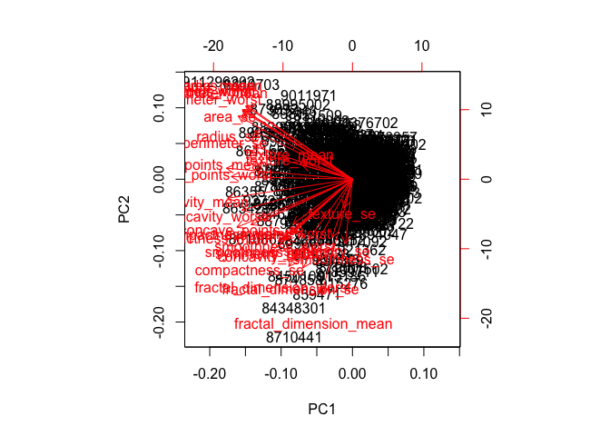

BreastCancer Wisconsin Diagnostic dataset
================
Shravan Kuchkula
10/22/2017

-   [Introduction](#introduction)
-   [Data set](#data-set)
-   [Importing and Cleaning the data](#importing-and-cleaning-the-data)
-   [Exploratory Data Analysis](#exploratory-data-analysis)
    -   [How many observations are in this dataset ?](#how-many-observations-are-in-this-dataset)
    -   [How many variables/features in the data are suffixed with \_mean, \_se, \_worst?](#how-many-variablesfeatures-in-the-data-are-suffixed-with-_mean-_se-_worst)
    -   [How many observations have benign or malignant diagnosis ?](#how-many-observations-have-benign-or-malignant-diagnosis)
    -   [What is the mean of each of the numeric columns ?](#what-is-the-mean-of-each-of-the-numeric-columns)
    -   [What is the sd of each of the numeric columns ?](#what-is-the-sd-of-each-of-the-numeric-columns)
-   [PCA](#pca)
    -   [Bi-Plot](#bi-plot)
    -   [Scree plots](#scree-plots)
-   [LDA](#lda)
-   [Splitting the dataset into training/test data](#splitting-the-dataset-into-trainingtest-data)
-   [Cross validation](#cross-validation)
-   [Conclusion](#conclusion)

Introduction
------------

Features are computed from a digitized image of a fine needle aspirate (FNA) of a breast mass. They describe characteristics of the cell nuclei present in the image.

Data set
--------

Breast Cancer Wisconsin data set from the [*UCI Machine learning repo*](http://archive.ics.uci.edu/ml/datasets/Breast+Cancer+Wisconsin+%28Diagnostic%29) is used to conduct the analysis.

Importing and Cleaning the data
-------------------------------

Before importing, let's first load the required libraries.

``` r
source('libraries.R')
```

Using read.csv we can download the dataset as shown:

``` r
url <- "http://archive.ics.uci.edu/ml/machine-learning-databases/breast-cancer-wisconsin/wdbc.data"

# use read_csv to the read into a dataframe
# columnNames are missing in the above link, so we need to give them manually.
columnNames <- c("id","diagnosis","radius_mean","texture_mean","perimeter_mean",
                 "area_mean","smoothness_mean","compactness_mean","concavity_mean",
                 "concave_points_mean","symmetry_mean","fractal_dimension_mean",
                 "radius_se","texture_se","perimeter_se","area_se","smoothness_se",
                 "compactness_se","concavity_se","concave_points_se","symmetry_se",
                 "fractal_dimension_se","radius_worst","texture_worst","perimeter_worst",
                 "area_worst","smoothness_worst","compactness_worst","concavity_worst",
                 "concave_points_worst","symmetry_worst","fractal_dimension_worst")
#wdbc <- read_csv(url, col_names = columnNames, col_types = NULL)
wdbc <- read.csv(url, header = FALSE, col.names = columnNames)
```

Let's take a peak

``` r
glimpse(wdbc)
```

    ## Observations: 569
    ## Variables: 32
    ## $ id                      <int> 842302, 842517, 84300903, 84348301, 84...
    ## $ diagnosis               <fctr> M, M, M, M, M, M, M, M, M, M, M, M, M...
    ## $ radius_mean             <dbl> 17.990, 20.570, 19.690, 11.420, 20.290...
    ## $ texture_mean            <dbl> 10.38, 17.77, 21.25, 20.38, 14.34, 15....
    ## $ perimeter_mean          <dbl> 122.80, 132.90, 130.00, 77.58, 135.10,...
    ## $ area_mean               <dbl> 1001.0, 1326.0, 1203.0, 386.1, 1297.0,...
    ## $ smoothness_mean         <dbl> 0.11840, 0.08474, 0.10960, 0.14250, 0....
    ## $ compactness_mean        <dbl> 0.27760, 0.07864, 0.15990, 0.28390, 0....
    ## $ concavity_mean          <dbl> 0.30010, 0.08690, 0.19740, 0.24140, 0....
    ## $ concave_points_mean     <dbl> 0.14710, 0.07017, 0.12790, 0.10520, 0....
    ## $ symmetry_mean           <dbl> 0.2419, 0.1812, 0.2069, 0.2597, 0.1809...
    ## $ fractal_dimension_mean  <dbl> 0.07871, 0.05667, 0.05999, 0.09744, 0....
    ## $ radius_se               <dbl> 1.0950, 0.5435, 0.7456, 0.4956, 0.7572...
    ## $ texture_se              <dbl> 0.9053, 0.7339, 0.7869, 1.1560, 0.7813...
    ## $ perimeter_se            <dbl> 8.589, 3.398, 4.585, 3.445, 5.438, 2.2...
    ## $ area_se                 <dbl> 153.40, 74.08, 94.03, 27.23, 94.44, 27...
    ## $ smoothness_se           <dbl> 0.006399, 0.005225, 0.006150, 0.009110...
    ## $ compactness_se          <dbl> 0.049040, 0.013080, 0.040060, 0.074580...
    ## $ concavity_se            <dbl> 0.05373, 0.01860, 0.03832, 0.05661, 0....
    ## $ concave_points_se       <dbl> 0.015870, 0.013400, 0.020580, 0.018670...
    ## $ symmetry_se             <dbl> 0.03003, 0.01389, 0.02250, 0.05963, 0....
    ## $ fractal_dimension_se    <dbl> 0.006193, 0.003532, 0.004571, 0.009208...
    ## $ radius_worst            <dbl> 25.38, 24.99, 23.57, 14.91, 22.54, 15....
    ## $ texture_worst           <dbl> 17.33, 23.41, 25.53, 26.50, 16.67, 23....
    ## $ perimeter_worst         <dbl> 184.60, 158.80, 152.50, 98.87, 152.20,...
    ## $ area_worst              <dbl> 2019.0, 1956.0, 1709.0, 567.7, 1575.0,...
    ## $ smoothness_worst        <dbl> 0.1622, 0.1238, 0.1444, 0.2098, 0.1374...
    ## $ compactness_worst       <dbl> 0.6656, 0.1866, 0.4245, 0.8663, 0.2050...
    ## $ concavity_worst         <dbl> 0.71190, 0.24160, 0.45040, 0.68690, 0....
    ## $ concave_points_worst    <dbl> 0.26540, 0.18600, 0.24300, 0.25750, 0....
    ## $ symmetry_worst          <dbl> 0.4601, 0.2750, 0.3613, 0.6638, 0.2364...
    ## $ fractal_dimension_worst <dbl> 0.11890, 0.08902, 0.08758, 0.17300, 0....

Exploratory Data Analysis
-------------------------

Our response variable is diagnosis: Benign (B) or Malignant (M). We have 3 sets of 10 numeric variables: mean, se, worst

Let's first collect all the 30 numeric variables into a matrix

``` r
# Convert the features of the data: wdbc.data
wdbc.data <- as.matrix(wdbc[,c(3:32)])

# Set the row names of wdbc.data
row.names(wdbc.data) <- wdbc$id

# Create diagnosis vector
diagnosis <- as.numeric(wdbc$diagnosis == "M")
```

Let's answer some basic questions:

### How many observations are in this dataset ?

``` r
nrow(wdbc.data)
```

    ## [1] 569

### How many variables/features in the data are suffixed with \_mean, \_se, \_worst?

``` r
sum(endsWith(colnames(wdbc.data), "_mean"))
```

    ## [1] 10

``` r
sum(endsWith(colnames(wdbc.data), "_se"))
```

    ## [1] 10

``` r
sum(endsWith(colnames(wdbc.data), "_worst"))
```

    ## [1] 10

### How many observations have benign or malignant diagnosis ?

``` r
table(wdbc$diagnosis)
```

    ## 
    ##   B   M 
    ## 357 212

### What is the mean of each of the numeric columns ?

``` r
colMeans(wdbc.data)
```

    ##             radius_mean            texture_mean          perimeter_mean 
    ##            1.412729e+01            1.928965e+01            9.196903e+01 
    ##               area_mean         smoothness_mean        compactness_mean 
    ##            6.548891e+02            9.636028e-02            1.043410e-01 
    ##          concavity_mean     concave_points_mean           symmetry_mean 
    ##            8.879932e-02            4.891915e-02            1.811619e-01 
    ##  fractal_dimension_mean               radius_se              texture_se 
    ##            6.279761e-02            4.051721e-01            1.216853e+00 
    ##            perimeter_se                 area_se           smoothness_se 
    ##            2.866059e+00            4.033708e+01            7.040979e-03 
    ##          compactness_se            concavity_se       concave_points_se 
    ##            2.547814e-02            3.189372e-02            1.179614e-02 
    ##             symmetry_se    fractal_dimension_se            radius_worst 
    ##            2.054230e-02            3.794904e-03            1.626919e+01 
    ##           texture_worst         perimeter_worst              area_worst 
    ##            2.567722e+01            1.072612e+02            8.805831e+02 
    ##        smoothness_worst       compactness_worst         concavity_worst 
    ##            1.323686e-01            2.542650e-01            2.721885e-01 
    ##    concave_points_worst          symmetry_worst fractal_dimension_worst 
    ##            1.146062e-01            2.900756e-01            8.394582e-02

### What is the sd of each of the numeric columns ?

``` r
apply(wdbc.data, 2, sd)
```

    ##             radius_mean            texture_mean          perimeter_mean 
    ##            3.524049e+00            4.301036e+00            2.429898e+01 
    ##               area_mean         smoothness_mean        compactness_mean 
    ##            3.519141e+02            1.406413e-02            5.281276e-02 
    ##          concavity_mean     concave_points_mean           symmetry_mean 
    ##            7.971981e-02            3.880284e-02            2.741428e-02 
    ##  fractal_dimension_mean               radius_se              texture_se 
    ##            7.060363e-03            2.773127e-01            5.516484e-01 
    ##            perimeter_se                 area_se           smoothness_se 
    ##            2.021855e+00            4.549101e+01            3.002518e-03 
    ##          compactness_se            concavity_se       concave_points_se 
    ##            1.790818e-02            3.018606e-02            6.170285e-03 
    ##             symmetry_se    fractal_dimension_se            radius_worst 
    ##            8.266372e-03            2.646071e-03            4.833242e+00 
    ##           texture_worst         perimeter_worst              area_worst 
    ##            6.146258e+00            3.360254e+01            5.693570e+02 
    ##        smoothness_worst       compactness_worst         concavity_worst 
    ##            2.283243e-02            1.573365e-01            2.086243e-01 
    ##    concave_points_worst          symmetry_worst fractal_dimension_worst 
    ##            6.573234e-02            6.186747e-02            1.806127e-02

PCA
---

Due to the number of variables in the model, we can try using a dimentionality reduction technique to unveil any patterns in the data. It also helps in visualizing a multi-dimentional dataset like this.

The first step in doing a PCA, is to ask ourselves whether or not the data should be scaled to unit variance. That is, to bring all the numeric variables to the same scale.

Based on the output from `mean` and `sd`, it does appear that some variables have larger variance, e.g. symmetry\_se. Hence we should use scaling. (will get this later and prove why we need to scale)

Running PCA:

``` r
wdbc.pr <- prcomp(wdbc.data, scale = TRUE, center = TRUE)
summary(wdbc.pr)
```

    ## Importance of components:
    ##                           PC1    PC2     PC3     PC4     PC5     PC6
    ## Standard deviation     3.6444 2.3857 1.67867 1.40735 1.28403 1.09880
    ## Proportion of Variance 0.4427 0.1897 0.09393 0.06602 0.05496 0.04025
    ## Cumulative Proportion  0.4427 0.6324 0.72636 0.79239 0.84734 0.88759
    ##                            PC7     PC8    PC9    PC10   PC11    PC12
    ## Standard deviation     0.82172 0.69037 0.6457 0.59219 0.5421 0.51104
    ## Proportion of Variance 0.02251 0.01589 0.0139 0.01169 0.0098 0.00871
    ## Cumulative Proportion  0.91010 0.92598 0.9399 0.95157 0.9614 0.97007
    ##                           PC13    PC14    PC15    PC16    PC17    PC18
    ## Standard deviation     0.49128 0.39624 0.30681 0.28260 0.24372 0.22939
    ## Proportion of Variance 0.00805 0.00523 0.00314 0.00266 0.00198 0.00175
    ## Cumulative Proportion  0.97812 0.98335 0.98649 0.98915 0.99113 0.99288
    ##                           PC19    PC20   PC21    PC22    PC23   PC24
    ## Standard deviation     0.22244 0.17652 0.1731 0.16565 0.15602 0.1344
    ## Proportion of Variance 0.00165 0.00104 0.0010 0.00091 0.00081 0.0006
    ## Cumulative Proportion  0.99453 0.99557 0.9966 0.99749 0.99830 0.9989
    ##                           PC25    PC26    PC27    PC28    PC29    PC30
    ## Standard deviation     0.12442 0.09043 0.08307 0.03987 0.02736 0.01153
    ## Proportion of Variance 0.00052 0.00027 0.00023 0.00005 0.00002 0.00000
    ## Cumulative Proportion  0.99942 0.99969 0.99992 0.99997 1.00000 1.00000

84.73% of the variation is explained by the first five PC's.

### Bi-Plot

Let's create a bi-plot to visualize this:

``` r
biplot(wdbc.pr)
```



From the above bi-plot of PC1 vs PC2, we can see that all these variables are trending in the same direction and most of them are highly correlated (More on this .. we can visualize this in a corrplot)

Create a scatter plot of observations by components 1 and 2

``` r
# Scatter plot observations by components 1 and 2
plot(wdbc.pr$x[, c(1, 2)], col = (diagnosis + 1), 
     xlab = "PC1", ylab = "PC2")
```


There is a clear seperation of diagnosis (M or B) that is evident in the PC1 vs PC2 plot.

Let's also take PC1 vs PC3 plot:

``` r
# Repeat for components 1 and 3
plot(wdbc.pr$x[, c(1,3)], col = (diagnosis + 1), 
     xlab = "PC1", ylab = "PC3")
```


Because principal component 2 explains more variance in the original data than principal component 3, you can see that the first plot has a cleaner cut separating the two subgroups.

### Scree plots

Scree plots can be useful in deciding how many PC's we should keep in the model. Let's create the scree-plots in R. As there is no R function to create a scree-plot, we need to prepare the data for the plot.

``` r
# Set up 1 x 2 plotting grid
par(mfrow = c(1, 2))

# Calculate variability of each component
pr.var <- wdbc.pr$sdev ^ 2

# Variance explained by each principal component: pve
pve <- pr.var/sum(pr.var)
```

Create a plot of variance explained for each principal component.

``` r
# Plot variance explained for each principal component
plot(pve, xlab = "Principal Component", 
     ylab = "Proportion of Variance Explained", 
     ylim = c(0, 1), type = "b")
```


``` r
# Plot cumulative proportion of variance explained
plot(cumsum(pve), xlab = "Principal Component", 
     ylab = "Cumulative Proportion of Variance Explained", 
     ylim = c(0, 1), type = "b")
```


Scree-plots suggest that 80% of the variation in the numeric data is captured in the first 5 PCs.

LDA
---

As found in the PCA analysis, we can keep 5 PCs in the model. Our next task is to use the first 5 PCs to build a Linear discriminant function using the `lda()` function in R.

Splitting the dataset into training/test data
---------------------------------------------

When creating the LDA model, we can split the data into training and test data. Using the training data we can build the LDA function. Next, we use the test data to make predictions.

Cross validation
----------------

A simple way to validate the accuracy of our model in predicting diagnosis (M or B) is to compare the test data result to the observed data. Find the proportion of the errors in prediction and see whether our model is acceptable.

An advanced way of validating the accuracy of our model is by using a k-fold cross-validation.

Conclusion
----------
