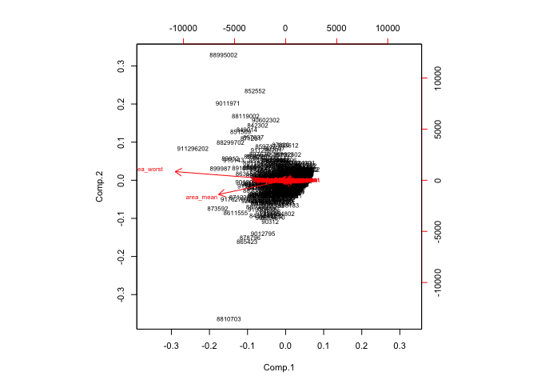

BreastCancer Wisconsin Diagnostic dataset
================
Shravan Kuchkula
10/22/2017

-   [Introduction](#introduction)
-   [Data set](#data-set)
-   [Importing and Cleaning the data](#importing-and-cleaning-the-data)
-   [Exploratory Data Analysis](#exploratory-data-analysis)
    -   [How many observations are in this dataset ?](#how-many-observations-are-in-this-dataset)
    -   [How many variables/features in the data are suffixed with \_mean, \_se, \_worst?](#how-many-variablesfeatures-in-the-data-are-suffixed-with-_mean-_se-_worst)
    -   [How many observations have benign or malignant diagnosis ?](#how-many-observations-have-benign-or-malignant-diagnosis)
    -   [What is the mean of each of the numeric columns ?](#what-is-the-mean-of-each-of-the-numeric-columns)
    -   [What is the sd of each of the numeric columns ?](#what-is-the-sd-of-each-of-the-numeric-columns)
    -   [How are the variables related to each other ?](#how-are-the-variables-related-to-each-other)
-   [PCA](#pca)
    -   [Running a PCA using covariance matrix:](#running-a-pca-using-covariance-matrix)
    -   [Bi-Plot](#bi-plot)
    -   [Scree plots](#scree-plots)
-   [LDA](#lda)
-   [Model Validation](#model-validation)
    -   [Splitting the dataset into training/test data](#splitting-the-dataset-into-trainingtest-data)
    -   [3-fold cross validation](#fold-cross-validation)
    -   [10-fold cross validation](#fold-cross-validation-1)
-   [Conclusion](#conclusion)

Introduction
------------

Features are computed from a digitized image of a fine needle aspirate (FNA) of a breast mass. They describe characteristics of the cell nuclei present in the image.

Data set
--------

Breast Cancer Wisconsin data set from the [*UCI Machine learning repo*](http://archive.ics.uci.edu/ml/datasets/Breast+Cancer+Wisconsin+%28Diagnostic%29) is used to conduct the analysis.

Importing and Cleaning the data
-------------------------------

Before importing, let's first load the required libraries.

``` r
source('libraries.R')
```

Using read.csv we can download the dataset as shown:

``` r
#url <- "http://archive.ics.uci.edu/ml/machine-learning-databases/breast-cancer-wisconsin/wdbc.data"
#download.file(url, 'wdbc.csv')

# use read_csv to the read into a dataframe
# columnNames are missing in the above link, so we need to give them manually.
columnNames <- c("id","diagnosis","radius_mean","texture_mean","perimeter_mean",
                 "area_mean","smoothness_mean","compactness_mean","concavity_mean",
                 "concave_points_mean","symmetry_mean","fractal_dimension_mean",
                 "radius_se","texture_se","perimeter_se","area_se","smoothness_se",
                 "compactness_se","concavity_se","concave_points_se","symmetry_se",
                 "fractal_dimension_se","radius_worst","texture_worst","perimeter_worst",
                 "area_worst","smoothness_worst","compactness_worst","concavity_worst",
                 "concave_points_worst","symmetry_worst","fractal_dimension_worst")
#wdbc <- read_csv(url, col_names = columnNames, col_types = NULL)
wdbc <- read.csv('wdbc.csv', header = FALSE, col.names = columnNames)
```

Let's take a peak

``` r
glimpse(wdbc)
```

    ## Observations: 569
    ## Variables: 32
    ## $ id                      <int> 842302, 842517, 84300903, 84348301, 84...
    ## $ diagnosis               <fctr> M, M, M, M, M, M, M, M, M, M, M, M, M...
    ## $ radius_mean             <dbl> 17.990, 20.570, 19.690, 11.420, 20.290...
    ## $ texture_mean            <dbl> 10.38, 17.77, 21.25, 20.38, 14.34, 15....
    ## $ perimeter_mean          <dbl> 122.80, 132.90, 130.00, 77.58, 135.10,...
    ## $ area_mean               <dbl> 1001.0, 1326.0, 1203.0, 386.1, 1297.0,...
    ## $ smoothness_mean         <dbl> 0.11840, 0.08474, 0.10960, 0.14250, 0....
    ## $ compactness_mean        <dbl> 0.27760, 0.07864, 0.15990, 0.28390, 0....
    ## $ concavity_mean          <dbl> 0.30010, 0.08690, 0.19740, 0.24140, 0....
    ## $ concave_points_mean     <dbl> 0.14710, 0.07017, 0.12790, 0.10520, 0....
    ## $ symmetry_mean           <dbl> 0.2419, 0.1812, 0.2069, 0.2597, 0.1809...
    ## $ fractal_dimension_mean  <dbl> 0.07871, 0.05667, 0.05999, 0.09744, 0....
    ## $ radius_se               <dbl> 1.0950, 0.5435, 0.7456, 0.4956, 0.7572...
    ## $ texture_se              <dbl> 0.9053, 0.7339, 0.7869, 1.1560, 0.7813...
    ## $ perimeter_se            <dbl> 8.589, 3.398, 4.585, 3.445, 5.438, 2.2...
    ## $ area_se                 <dbl> 153.40, 74.08, 94.03, 27.23, 94.44, 27...
    ## $ smoothness_se           <dbl> 0.006399, 0.005225, 0.006150, 0.009110...
    ## $ compactness_se          <dbl> 0.049040, 0.013080, 0.040060, 0.074580...
    ## $ concavity_se            <dbl> 0.05373, 0.01860, 0.03832, 0.05661, 0....
    ## $ concave_points_se       <dbl> 0.015870, 0.013400, 0.020580, 0.018670...
    ## $ symmetry_se             <dbl> 0.03003, 0.01389, 0.02250, 0.05963, 0....
    ## $ fractal_dimension_se    <dbl> 0.006193, 0.003532, 0.004571, 0.009208...
    ## $ radius_worst            <dbl> 25.38, 24.99, 23.57, 14.91, 22.54, 15....
    ## $ texture_worst           <dbl> 17.33, 23.41, 25.53, 26.50, 16.67, 23....
    ## $ perimeter_worst         <dbl> 184.60, 158.80, 152.50, 98.87, 152.20,...
    ## $ area_worst              <dbl> 2019.0, 1956.0, 1709.0, 567.7, 1575.0,...
    ## $ smoothness_worst        <dbl> 0.1622, 0.1238, 0.1444, 0.2098, 0.1374...
    ## $ compactness_worst       <dbl> 0.6656, 0.1866, 0.4245, 0.8663, 0.2050...
    ## $ concavity_worst         <dbl> 0.71190, 0.24160, 0.45040, 0.68690, 0....
    ## $ concave_points_worst    <dbl> 0.26540, 0.18600, 0.24300, 0.25750, 0....
    ## $ symmetry_worst          <dbl> 0.4601, 0.2750, 0.3613, 0.6638, 0.2364...
    ## $ fractal_dimension_worst <dbl> 0.11890, 0.08902, 0.08758, 0.17300, 0....

Exploratory Data Analysis
-------------------------

Our response variable is diagnosis: Benign (B) or Malignant (M). We have 3 sets of 10 numeric variables: mean, se, worst

Let's first collect all the 30 numeric variables into a matrix

``` r
# Convert the features of the data: wdbc.data
wdbc.data <- as.matrix(wdbc[,c(3:32)])

# Set the row names of wdbc.data
row.names(wdbc.data) <- wdbc$id

# Create diagnosis vector
diagnosis <- as.numeric(wdbc$diagnosis == "M")
```

Let's answer some basic questions:

### How many observations are in this dataset ?

``` r
nrow(wdbc.data)
```

    ## [1] 569

### How many variables/features in the data are suffixed with \_mean, \_se, \_worst?

``` r
sum(endsWith(colnames(wdbc.data), "_mean"))
```

    ## [1] 10

``` r
sum(endsWith(colnames(wdbc.data), "_se"))
```

    ## [1] 10

``` r
sum(endsWith(colnames(wdbc.data), "_worst"))
```

    ## [1] 10

### How many observations have benign or malignant diagnosis ?

``` r
table(wdbc$diagnosis)
```

    ## 
    ##   B   M 
    ## 357 212

### What is the mean of each of the numeric columns ?

``` r
round(colMeans(wdbc.data),2)
```

    ##             radius_mean            texture_mean          perimeter_mean 
    ##                   14.13                   19.29                   91.97 
    ##               area_mean         smoothness_mean        compactness_mean 
    ##                  654.89                    0.10                    0.10 
    ##          concavity_mean     concave_points_mean           symmetry_mean 
    ##                    0.09                    0.05                    0.18 
    ##  fractal_dimension_mean               radius_se              texture_se 
    ##                    0.06                    0.41                    1.22 
    ##            perimeter_se                 area_se           smoothness_se 
    ##                    2.87                   40.34                    0.01 
    ##          compactness_se            concavity_se       concave_points_se 
    ##                    0.03                    0.03                    0.01 
    ##             symmetry_se    fractal_dimension_se            radius_worst 
    ##                    0.02                    0.00                   16.27 
    ##           texture_worst         perimeter_worst              area_worst 
    ##                   25.68                  107.26                  880.58 
    ##        smoothness_worst       compactness_worst         concavity_worst 
    ##                    0.13                    0.25                    0.27 
    ##    concave_points_worst          symmetry_worst fractal_dimension_worst 
    ##                    0.11                    0.29                    0.08

### What is the sd of each of the numeric columns ?

``` r
roundSD <- function(x){
  round(sd(x),2)
}
apply(wdbc.data, 2, roundSD)
```

    ##             radius_mean            texture_mean          perimeter_mean 
    ##                    3.52                    4.30                   24.30 
    ##               area_mean         smoothness_mean        compactness_mean 
    ##                  351.91                    0.01                    0.05 
    ##          concavity_mean     concave_points_mean           symmetry_mean 
    ##                    0.08                    0.04                    0.03 
    ##  fractal_dimension_mean               radius_se              texture_se 
    ##                    0.01                    0.28                    0.55 
    ##            perimeter_se                 area_se           smoothness_se 
    ##                    2.02                   45.49                    0.00 
    ##          compactness_se            concavity_se       concave_points_se 
    ##                    0.02                    0.03                    0.01 
    ##             symmetry_se    fractal_dimension_se            radius_worst 
    ##                    0.01                    0.00                    4.83 
    ##           texture_worst         perimeter_worst              area_worst 
    ##                    6.15                   33.60                  569.36 
    ##        smoothness_worst       compactness_worst         concavity_worst 
    ##                    0.02                    0.16                    0.21 
    ##    concave_points_worst          symmetry_worst fractal_dimension_worst 
    ##                    0.07                    0.06                    0.02

### How are the variables related to each other ?

``` r
corMatrix <- wdbc[,c(3:32)]


# Rename the colnames
cNames <- c("rad_m","txt_m","per_m",
                 "are_m","smt_m","cmp_m","con_m",
                 "ccp_m","sym_m","frd_m",
                 "rad_se","txt_se","per_se","are_se","smt_se",
                 "cmp_se","con_se","ccp_se","sym_se",
                 "frd_se","rad_w","txt_w","per_w",
                 "are_w","smt_w","cmp_w","con_w",
                 "ccp_w","sym_w","frd_w")

colnames(corMatrix) <- cNames

# Create the correlation matrix
M <- round(cor(corMatrix), 2)

# Create corrplot
corrplot(M, diag = FALSE, method="color", order="FPC", tl.srt = 90)
```


From the corrplot, it is evident that there are many variables that are highly correlated with each other.

PCA
---

*Why PCA?* Due to the number of variables in the model, we can try using a dimensionality reduction technique to unveil any patterns in the data. As mentioned in the Exploratory Data Analysis section, there are thirty variables that when combined can be used to model each patient’s diagnosis. Using PCA we can combine our many variables into different linear combinations that each explain a part of the variance of the model. By proceeding with PCA we are assuming the linearity of the combinations of our variables within the dataset. By choosing only the linear combinations that provide a majority (&gt;= 85%) of the co-variance, we can reduce the complexity of our model. We can then more easily see how the model works and provide meaningful graphs and representations of our complex dataset.

The first step in doing a PCA, is to ask ourselves whether or not the data should be scaled to unit variance. That is, to bring all the numeric variables to the same scale. In other words, we are trying to determine whether we should use a correlation matrix or a covariance matrix in our calculations of eigen values and eigen vectors (aka principal components).

### Running a PCA using covariance matrix:

When the covariance matrix is used to calculate the eigen values and eigen vectors, we use the `princomp()` function. Let's take a look at the summary of the princomp output.

``` r
wdbc.pcov <- princomp(wdbc.data, scores = TRUE)
summary(wdbc.pcov)
```

    ## Importance of components:
    ##                             Comp.1      Comp.2       Comp.3      Comp.4
    ## Standard deviation     665.5844581 85.42395908 26.506542133 7.385979582
    ## Proportion of Variance   0.9820447  0.01617649  0.001557511 0.000120932
    ## Cumulative Proportion    0.9820447  0.99822116  0.999778672 0.999899604
    ##                              Comp.5       Comp.6       Comp.7       Comp.8
    ## Standard deviation     6.310302e+00 1.731851e+00 1.346157e+00 6.089449e-01
    ## Proportion of Variance 8.827245e-05 6.648840e-06 4.017137e-06 8.220172e-07
    ## Cumulative Proportion  9.999879e-01 9.999945e-01 9.999985e-01 9.999994e-01
    ##                              Comp.9      Comp.10      Comp.11      Comp.12
    ## Standard deviation     3.940054e-01 2.896782e-01 1.776328e-01 8.651121e-02
    ## Proportion of Variance 3.441353e-07 1.860187e-07 6.994732e-08 1.659089e-08
    ## Cumulative Proportion  9.999997e-01 9.999999e-01 1.000000e+00 1.000000e+00
    ##                             Comp.13      Comp.14      Comp.15      Comp.16
    ## Standard deviation     5.617918e-02 4.645111e-02 3.638966e-02 2.528130e-02
    ## Proportion of Variance 6.996416e-09 4.783183e-09 2.935492e-09 1.416849e-09
    ## Cumulative Proportion  1.000000e+00 1.000000e+00 1.000000e+00 1.000000e+00
    ##                             Comp.17      Comp.18      Comp.19      Comp.20
    ## Standard deviation     1.934488e-02 1.532176e-02 1.357421e-02 1.280201e-02
    ## Proportion of Variance 8.295777e-10 5.204059e-10 4.084640e-10 3.633134e-10
    ## Cumulative Proportion  1.000000e+00 1.000000e+00 1.000000e+00 1.000000e+00
    ##                             Comp.21      Comp.22     Comp.23      Comp.24
    ## Standard deviation     8.830228e-03 7.583529e-03 5.90389e-03 5.324037e-03
    ## Proportion of Variance 1.728497e-10 1.274875e-10 7.72683e-11 6.283577e-11
    ## Cumulative Proportion  1.000000e+00 1.000000e+00 1.00000e+00 1.000000e+00
    ##                             Comp.25      Comp.26      Comp.27      Comp.28
    ## Standard deviation     4.014722e-03 3.531047e-03 1.916772e-03 1.686090e-03
    ## Proportion of Variance 3.573023e-11 2.763960e-11 8.144523e-12 6.302115e-12
    ## Cumulative Proportion  1.000000e+00 1.000000e+00 1.000000e+00 1.000000e+00
    ##                             Comp.29      Comp.30
    ## Standard deviation     1.414706e-03 8.371162e-04
    ## Proportion of Variance 4.436669e-12 1.553447e-12
    ## Cumulative Proportion  1.000000e+00 1.000000e+00

Bi-plot using covariance matrix: Looking at the descriptive statistics of “area\_mean” and “area\_worst”, we can observe that they have unusually large values for both mean and standard deviation. The units of measurements for these variables are different than the units of measurements of the other numeric variables. The effect of using variables with different scales can lead to amplified variances. This can be visually assessed by looking at the bi-plot of PC1 vs PC2, calculated from using non-scaled data (vs) scaled data. Below output shows non-scaled data since we are using a covariance matrix.

``` r
cex.before <- par("cex")
par(cex = 0.7)
biplot(wdbc.pcov)
```



``` r
par(cex = cex.before)
```

Scree plots can be useful in deciding how many PC's we should keep in the model. Let's create the scree-plots in R. As there is no R function to create a scree-plot, we need to prepare the data for the plot.

``` r
# Set up 1 x 2 plotting grid
par(mfrow = c(1, 2))

# Calculate variability of each component
pr.cvar <- wdbc.pcov$sdev ^ 2

# Variance explained by each principal component: pve
pve_cov <- pr.cvar/sum(pr.cvar)
```

Before visualizing the scree-plot, lets check the values:

``` r
# Eigen values
round(pr.cvar, 2)
```

    ##    Comp.1    Comp.2    Comp.3    Comp.4    Comp.5    Comp.6    Comp.7 
    ## 443002.67   7297.25    702.60     54.55     39.82      3.00      1.81 
    ##    Comp.8    Comp.9   Comp.10   Comp.11   Comp.12   Comp.13   Comp.14 
    ##      0.37      0.16      0.08      0.03      0.01      0.00      0.00 
    ##   Comp.15   Comp.16   Comp.17   Comp.18   Comp.19   Comp.20   Comp.21 
    ##      0.00      0.00      0.00      0.00      0.00      0.00      0.00 
    ##   Comp.22   Comp.23   Comp.24   Comp.25   Comp.26   Comp.27   Comp.28 
    ##      0.00      0.00      0.00      0.00      0.00      0.00      0.00 
    ##   Comp.29   Comp.30 
    ##      0.00      0.00

``` r
# Percent variance explained
round(pve_cov, 2)
```

    ##  Comp.1  Comp.2  Comp.3  Comp.4  Comp.5  Comp.6  Comp.7  Comp.8  Comp.9 
    ##    0.98    0.02    0.00    0.00    0.00    0.00    0.00    0.00    0.00 
    ## Comp.10 Comp.11 Comp.12 Comp.13 Comp.14 Comp.15 Comp.16 Comp.17 Comp.18 
    ##    0.00    0.00    0.00    0.00    0.00    0.00    0.00    0.00    0.00 
    ## Comp.19 Comp.20 Comp.21 Comp.22 Comp.23 Comp.24 Comp.25 Comp.26 Comp.27 
    ##    0.00    0.00    0.00    0.00    0.00    0.00    0.00    0.00    0.00 
    ## Comp.28 Comp.29 Comp.30 
    ##    0.00    0.00    0.00

``` r
# Cummulative percent explained
round(cumsum(pve_cov), 2)
```

    ##  Comp.1  Comp.2  Comp.3  Comp.4  Comp.5  Comp.6  Comp.7  Comp.8  Comp.9 
    ##    0.98    1.00    1.00    1.00    1.00    1.00    1.00    1.00    1.00 
    ## Comp.10 Comp.11 Comp.12 Comp.13 Comp.14 Comp.15 Comp.16 Comp.17 Comp.18 
    ##    1.00    1.00    1.00    1.00    1.00    1.00    1.00    1.00    1.00 
    ## Comp.19 Comp.20 Comp.21 Comp.22 Comp.23 Comp.24 Comp.25 Comp.26 Comp.27 
    ##    1.00    1.00    1.00    1.00    1.00    1.00    1.00    1.00    1.00 
    ## Comp.28 Comp.29 Comp.30 
    ##    1.00    1.00    1.00

Create a plot of variance explained for each principal component.

Scree plot using covariance matrix:

``` r
# Plot variance explained for each principal component
plot(pve_cov, xlab = "Principal Component", 
     ylab = "Proportion of Variance Explained", 
     ylim = c(0, 1), type = "b")
```


``` r
# Plot cumulative proportion of variance explained
plot(cumsum(pve_cov), xlab = "Principal Component", 
     ylab = "Cumulative Proportion of Variance Explained", 
     ylim = c(0, 1), type = "b")
```


Running PCA using correlation matrix:

``` r
wdbc.pr <- prcomp(wdbc.data, scale = TRUE, center = TRUE)
summary(wdbc.pr)
```

    ## Importance of components:
    ##                           PC1    PC2     PC3     PC4     PC5     PC6
    ## Standard deviation     3.6444 2.3857 1.67867 1.40735 1.28403 1.09880
    ## Proportion of Variance 0.4427 0.1897 0.09393 0.06602 0.05496 0.04025
    ## Cumulative Proportion  0.4427 0.6324 0.72636 0.79239 0.84734 0.88759
    ##                            PC7     PC8    PC9    PC10   PC11    PC12
    ## Standard deviation     0.82172 0.69037 0.6457 0.59219 0.5421 0.51104
    ## Proportion of Variance 0.02251 0.01589 0.0139 0.01169 0.0098 0.00871
    ## Cumulative Proportion  0.91010 0.92598 0.9399 0.95157 0.9614 0.97007
    ##                           PC13    PC14    PC15    PC16    PC17    PC18
    ## Standard deviation     0.49128 0.39624 0.30681 0.28260 0.24372 0.22939
    ## Proportion of Variance 0.00805 0.00523 0.00314 0.00266 0.00198 0.00175
    ## Cumulative Proportion  0.97812 0.98335 0.98649 0.98915 0.99113 0.99288
    ##                           PC19    PC20   PC21    PC22    PC23   PC24
    ## Standard deviation     0.22244 0.17652 0.1731 0.16565 0.15602 0.1344
    ## Proportion of Variance 0.00165 0.00104 0.0010 0.00091 0.00081 0.0006
    ## Cumulative Proportion  0.99453 0.99557 0.9966 0.99749 0.99830 0.9989
    ##                           PC25    PC26    PC27    PC28    PC29    PC30
    ## Standard deviation     0.12442 0.09043 0.08307 0.03987 0.02736 0.01153
    ## Proportion of Variance 0.00052 0.00027 0.00023 0.00005 0.00002 0.00000
    ## Cumulative Proportion  0.99942 0.99969 0.99992 0.99997 1.00000 1.00000

84.73% of the variation is explained by the first five PC's.

Get the eigen values of correlation matrix:

``` r
# Eigen values using covariance matrix

round(wdbc.pr$sdev ^2,4)
```

    ##  [1] 13.2816  5.6914  2.8179  1.9806  1.6487  1.2074  0.6752  0.4766
    ##  [9]  0.4169  0.3507  0.2939  0.2612  0.2414  0.1570  0.0941  0.0799
    ## [17]  0.0594  0.0526  0.0495  0.0312  0.0300  0.0274  0.0243  0.0181
    ## [25]  0.0155  0.0082  0.0069  0.0016  0.0007  0.0001

### Bi-Plot

Let's create a bi-plot to visualize this:

``` r
cex.before <- par("cex")
par(cex = 0.7)
biplot(wdbc.pr)
```


``` r
par(cex = cex.before)
```

From the above bi-plot of PC1 vs PC2, we can see that all these variables are trending in the same direction and most of them are highly correlated (More on this .. we can visualize this in a corrplot)

Create a scatter plot of observations by components 1 and 2

``` r
# Scatter plot observations by components 1 and 2
plot(wdbc.pr$x[, c(1, 2)], col = (diagnosis + 1), 
     xlab = "PC1", ylab = "PC2")
legend(x="topleft", pch=1, col = c("red", "black"), legend = c("B", "M"))
```


There is a clear seperation of diagnosis (M or B) that is evident in the PC1 vs PC2 plot.

Let's also take PC1 vs PC3 plot:

``` r
# Repeat for components 1 and 3
plot(wdbc.pr$x[, c(1,3)], col = (diagnosis + 1), 
     xlab = "PC1", ylab = "PC3")
legend(x="topleft", pch=1, col = c("red", "black"), legend = c("B", "M"))
```


Because principal component 2 explains more variance in the original data than principal component 3, you can see that the first plot has a cleaner cut separating the two subgroups.

``` r
# Repeat for components 1 and 3
plot(wdbc.pr$x[, c(1,4)], col = (diagnosis + 1), 
     xlab = "PC1", ylab = "PC4")
legend(x="topleft", pch=1, col = c("red", "black"), legend = c("B", "M"))
```


``` r
# Repeat for components 1 and 3
plot(wdbc.pr$x[, c(1,5)], col = (diagnosis + 1), 
     xlab = "PC1", ylab = "PC5")
legend(x="topleft", pch=1, col = c("red", "black"), legend = c("B", "M"))
```


``` r
# Repeat for components 1 and 6
plot(wdbc.pr$x[, c(1,6)], col = (diagnosis + 1), 
     xlab = "PC1", ylab = "PC6")
legend(x="topleft", pch=1, col = c("red", "black"), legend = c("B", "M"))
```


### Scree plots

Scree plots can be useful in deciding how many PC's we should keep in the model. Let's create the scree-plots in R. As there is no R function to create a scree-plot, we need to prepare the data for the plot.

``` r
# Set up 1 x 2 plotting grid
par(mfrow = c(1, 2))

# Calculate variability of each component
pr.var <- wdbc.pr$sdev ^ 2

# Assign names to the columns to be consistent with princomp.
# This is done for reporting purposes.
names(pr.var) <- names(pr.cvar)

# Variance explained by each principal component: pve
pve <- pr.var/sum(pr.var)

# Assign names to the columns as it is not done by default.
# This is done to be consistent with princomp.
names(pve) <- names(pve_cov)
```

Before creating the plot, let's see the values

``` r
# Eigen values
round(pr.var, 2)
```

    ##  Comp.1  Comp.2  Comp.3  Comp.4  Comp.5  Comp.6  Comp.7  Comp.8  Comp.9 
    ##   13.28    5.69    2.82    1.98    1.65    1.21    0.68    0.48    0.42 
    ## Comp.10 Comp.11 Comp.12 Comp.13 Comp.14 Comp.15 Comp.16 Comp.17 Comp.18 
    ##    0.35    0.29    0.26    0.24    0.16    0.09    0.08    0.06    0.05 
    ## Comp.19 Comp.20 Comp.21 Comp.22 Comp.23 Comp.24 Comp.25 Comp.26 Comp.27 
    ##    0.05    0.03    0.03    0.03    0.02    0.02    0.02    0.01    0.01 
    ## Comp.28 Comp.29 Comp.30 
    ##    0.00    0.00    0.00

``` r
# Percent variance explained
round(pve, 2)
```

    ##  Comp.1  Comp.2  Comp.3  Comp.4  Comp.5  Comp.6  Comp.7  Comp.8  Comp.9 
    ##    0.44    0.19    0.09    0.07    0.05    0.04    0.02    0.02    0.01 
    ## Comp.10 Comp.11 Comp.12 Comp.13 Comp.14 Comp.15 Comp.16 Comp.17 Comp.18 
    ##    0.01    0.01    0.01    0.01    0.01    0.00    0.00    0.00    0.00 
    ## Comp.19 Comp.20 Comp.21 Comp.22 Comp.23 Comp.24 Comp.25 Comp.26 Comp.27 
    ##    0.00    0.00    0.00    0.00    0.00    0.00    0.00    0.00    0.00 
    ## Comp.28 Comp.29 Comp.30 
    ##    0.00    0.00    0.00

``` r
# Cummulative percent explained
round(cumsum(pve), 2)
```

    ##  Comp.1  Comp.2  Comp.3  Comp.4  Comp.5  Comp.6  Comp.7  Comp.8  Comp.9 
    ##    0.44    0.63    0.73    0.79    0.85    0.89    0.91    0.93    0.94 
    ## Comp.10 Comp.11 Comp.12 Comp.13 Comp.14 Comp.15 Comp.16 Comp.17 Comp.18 
    ##    0.95    0.96    0.97    0.98    0.98    0.99    0.99    0.99    0.99 
    ## Comp.19 Comp.20 Comp.21 Comp.22 Comp.23 Comp.24 Comp.25 Comp.26 Comp.27 
    ##    0.99    1.00    1.00    1.00    1.00    1.00    1.00    1.00    1.00 
    ## Comp.28 Comp.29 Comp.30 
    ##    1.00    1.00    1.00

Create a plot of variance explained for each principal component.

``` r
# Plot variance explained for each principal component
plot(pve, xlab = "Principal Component", 
     ylab = "Proportion of Variance Explained", 
     ylim = c(0, 1), type = "b")
```


``` r
# Plot cumulative proportion of variance explained
plot(cumsum(pve), xlab = "Principal Component", 
     ylab = "Cumulative Proportion of Variance Explained", 
     ylim = c(0, 1), type = "b")
```


Scree-plots suggest that 80% of the variation in the numeric data is captured in the first 5 PCs.

LDA
---

As found in the PCA analysis, we can keep 5 PCs in the model. Our next task is to use the first 5 PCs to build a Linear discriminant function using the `lda()` function in R.

From the `wdbc.pr` object, we need to extract the first five PC's. To do this, let's first check the variables available for this object.

``` r
ls(wdbc.pr)
```

    ## [1] "center"   "rotation" "scale"    "sdev"     "x"

We are interested in the `rotation` (also called loadings) of the first five principal components multiplied by the scaled data, which are called `scores` (basically PC transformed data)

``` r
wdbc.pcs <- wdbc.pr$x[,1:6]
head(wdbc.pcs, 20)
```

    ##                 PC1          PC2        PC3         PC4         PC5
    ## 842302   -9.1847552  -1.94687003 -1.1221788  3.63053641  1.19405948
    ## 842517   -2.3857026   3.76485906 -0.5288274  1.11728077 -0.62122836
    ## 84300903 -5.7288555   1.07422859 -0.5512625  0.91128084  0.17693022
    ## 84348301 -7.1166913 -10.26655564 -3.2299475  0.15241292  2.95827543
    ## 84358402 -3.9318425   1.94635898  1.3885450  2.93805417 -0.54626674
    ## 843786   -2.3781546  -3.94645643 -2.9322967  0.94020959  1.05511354
    ## 844359   -2.2369151   2.68766641 -1.6384712  0.14920860 -0.04032404
    ## 84458202 -2.1414143  -2.33818665 -0.8711807 -0.12693117  1.42618178
    ## 844981   -3.1721332  -3.38883114 -3.1172431 -0.60076844  1.52095211
    ## 84501001 -6.3461628  -7.72038095 -4.3380987 -3.37223437 -1.70875961
    ## 845636    0.8097013   2.65693767 -0.4884001 -1.67109618 -0.27556910
    ## 84610002 -2.6487698  -0.06650941 -1.5251134  0.05121650 -0.33165929
    ## 846226   -8.1778388  -2.69860201  5.7251932 -1.11127875 -1.04255311
    ## 846381   -0.3418251   0.96742803  1.7156620 -0.59447987 -0.46759907
    ## 84667401 -4.3385617  -4.85680983 -2.8136398 -1.45327830 -1.28892873
    ## 84799002 -4.0720732  -2.97444398 -3.1225267 -2.45590991  0.40798314
    ## 848406   -0.2298528   1.56338211 -0.8018136 -0.65001097  0.49427614
    ## 84862001 -4.4141269  -1.41742315 -2.2683231 -0.18610866  1.42260945
    ## 849014   -4.9443530   4.11071653 -0.3144724 -0.08812897  0.05666532
    ## 8510426   1.2359758   0.18804949 -0.5927619  1.59494272  0.44176553
    ##                  PC6
    ## 842302    1.41018364
    ## 842517    0.02863116
    ## 84300903  0.54097615
    ## 84348301  3.05073750
    ## 84358402 -1.22541641
    ## 843786   -0.45064213
    ## 844359   -0.12883507
    ## 84458202 -1.25593410
    ## 844981    0.55905282
    ## 84501001 -0.72327234
    ## 845636    0.12721990
    ## 84610002  0.76419423
    ## 846226    2.59229030
    ## 846381    1.00677426
    ## 84667401 -0.34940880
    ## 84799002  0.49534213
    ## 848406   -0.76152096
    ## 84862001 -0.75182778
    ## 849014   -1.13668869
    ## 8510426  -0.04859402

Here, the rownames help us see how the PC transformed data looks like.

Now, we need to append the `diagnosis` column to this PC transformed data frame `wdbc.pcs`. Let's call the new data frame as `wdbc.pcst`.

``` r
wdbc.pcst <- wdbc.pcs
wdbc.pcst <- cbind(wdbc.pcs, diagnosis)
head(wdbc.pcst)
```

    ##                PC1        PC2        PC3       PC4        PC5         PC6
    ## 842302   -9.184755  -1.946870 -1.1221788 3.6305364  1.1940595  1.41018364
    ## 842517   -2.385703   3.764859 -0.5288274 1.1172808 -0.6212284  0.02863116
    ## 84300903 -5.728855   1.074229 -0.5512625 0.9112808  0.1769302  0.54097615
    ## 84348301 -7.116691 -10.266556 -3.2299475 0.1524129  2.9582754  3.05073750
    ## 84358402 -3.931842   1.946359  1.3885450 2.9380542 -0.5462667 -1.22541641
    ## 843786   -2.378155  -3.946456 -2.9322967 0.9402096  1.0551135 -0.45064213
    ##          diagnosis
    ## 842302           1
    ## 842517           1
    ## 84300903         1
    ## 84348301         1
    ## 84358402         1
    ## 843786           1

Here, diagnosis == 1 represents malignant and diagnosis == 0 represents benign.

Model Validation
----------------

To evaluate the effectiveness of our model in predicting the diagnosis of breast cancer, we can split the original data set into training and test data. Using the training data, we will build the model and predict using the test data. We will then compare the predictions with the original data to check the accuracy of our predictions. We will use three approaches to split and validate the data. In the first approach, we use 75% of the data as our training dataset and 25% as our test dataset. In the second approach, we use 3-fold cross validation and in the third approach we extend that to a 10-fold cross validation.

### Splitting the dataset into training/test data

When creating the LDA model, we can split the data into training and test data. Using the training data we can build the LDA function. Next, we use the test data to make predictions.

``` r
# Calculate N
N <- nrow(wdbc.pcst)

# Create a random number vector
rvec <- runif(N)

# Select rows from the dataframe
wdbc.pcst.train <- wdbc.pcst[rvec < 0.75,]
wdbc.pcst.test <- wdbc.pcst[rvec >= 0.75,]

# Check the number of observations
nrow(wdbc.pcst.train)
```

    ## [1] 430

``` r
nrow(wdbc.pcst.test)
```

    ## [1] 139

So, 430 observations are in training dataset and 139 observations are in the test dataset. We will use the training dataset to calculate the `linear discriminant function` by passing it to the `lda()` function of the `MASS` package.

``` r
library(MASS)

wdbc.pcst.train.df <- wdbc.pcst.train

# convert matrix to a dataframe
wdbc.pcst.train.df <- as.data.frame(wdbc.pcst.train)

# Perform LDA on diagnosis
wdbc.lda <- lda(diagnosis ~ PC1 + PC2 + PC3 + PC4 + PC5 + PC6, data = wdbc.pcst.train.df)
```

Let's summarize the LDA output:

``` r
wdbc.lda
```

    ## Call:
    ## lda(diagnosis ~ PC1 + PC2 + PC3 + PC4 + PC5 + PC6, data = wdbc.pcst.train.df)
    ## 
    ## Prior probabilities of groups:
    ##         0         1 
    ## 0.6116279 0.3883721 
    ## 
    ## Group means:
    ##         PC1        PC2        PC3        PC4        PC5         PC6
    ## 0  2.175770 -0.3110211  0.2809223  0.0878635 -0.1468713  0.04348643
    ## 1 -3.680665  0.5687389 -0.3382874 -0.2773845  0.1828439 -0.03302622
    ## 
    ## Coefficients of linear discriminants:
    ##             LD1
    ## PC1 -0.45279427
    ## PC2  0.17245630
    ## PC3 -0.20676053
    ## PC4 -0.18577816
    ## PC5  0.18617204
    ## PC6 -0.03166041

Let's use this to predict by passing the predict function's newdata as the testing dataset.

``` r
wdbc.pcst.test.df <- wdbc.pcst.test

# convert matrix to a dataframe
wdbc.pcst.test.df <- as.data.frame(wdbc.pcst.test)

wdbc.lda.predict <- predict(wdbc.lda, newdata = wdbc.pcst.test.df)
```

Let's check what functions we can invoke on this predict object:

``` r
ls(wdbc.lda.predict)
```

    ## [1] "class"     "posterior" "x"

Our predictions are contained in the `class` attribute.

``` r
# print the predictions
(wdbc.lda.predict.class <- wdbc.lda.predict$class)
```

    ##   [1] 1 1 1 0 1 1 1 1 1 0 1 0 1 1 0 1 0 1 1 0 1 0 0 1 0 0 0 0 0 0 0 0 0 0 0
    ##  [36] 0 0 1 1 0 0 0 1 1 0 1 0 0 1 1 1 0 1 1 0 0 0 0 1 1 1 0 0 0 0 1 1 0 0 0
    ##  [71] 0 0 0 0 0 0 0 0 1 1 0 0 0 1 0 1 0 1 0 0 1 0 0 0 0 0 0 0 0 0 0 0 0 0 0
    ## [106] 0 0 0 0 0 0 0 0 0 0 1 0 0 0 0 0 0 1 0 1 0 0 0 0 1 0 0 0 0 0 0 1 1 0
    ## Levels: 0 1

Next, compare the accuracy of these predictions with the original data.

A simple way to validate the accuracy of our model in predicting diagnosis (M or B) is to compare the test data result to the observed data. Find the proportion of the errors in prediction and see whether our model is acceptable.

``` r
(confusionMat <- table(wdbc.lda.predict.class, wdbc.pcst.test.df$diagnosis))
```

    ##                       
    ## wdbc.lda.predict.class  0  1
    ##                      0 94  2
    ##                      1  0 43

So according to this output, the model predicted 94 times that the diagnosis is 0 (benign) when the actual observation was 0 (benign) and 2 times it predicted incorrectly. Similarly, the model predicted that the diagnosis is 1 (malignant) 43 times correctly and 0 predicted incorrectly.

The accuracy of this model in predicting benign tumors is 0.9791667 or 97.9166667% accurate. The accuracy of this model in predicting malignant tumors is 1 or 100% accurate.

What is the classification accuracy of this model ?

What is the sensitivity of this model ?

What is the Specificity of this model ?

> Note: The above table is termed as a confusion matrix. From a confusion matrix you can calculate some measures such as: classification accuracy, sensitivity and specificity.

### 3-fold cross validation

We can implement a cross-validation plan using the `vtreat` package's `kWayCrossValidation` function. Syntax: kWayCrossValidation(nRows, nSplits, dframe, y)

nRows - number of rows in the training data nSplits - number of folds (partitions) in the cross-validation. E.g, 3 for 3-way CV remaining 2 arguments not needed.

The function returns indicies for training and test data for each fold. Use the data with the training indicies to fit the model and then make predictions using the test indicies. If the estimated model performance looks good, then use all the data to fit a final model. You can't evaluate this final model, becuase you don't have data to evaluate it with. Cross Validation only tests the modeling process, while the test/train split tests the final model.

``` r
library(vtreat)

# convert wdbc.pcst to a dataframe
wdbc.pcst.df <- as.data.frame(wdbc.pcst)

nRows <- nrow(wdbc.pcst.df)
splitPlan <- kWayCrossValidation(nRows, 3, NULL, NULL)

# examine the split plan
str(splitPlan)
```

    ## List of 3
    ##  $ :List of 2
    ##   ..$ train: int [1:380] 1 4 6 7 9 12 14 15 16 17 ...
    ##   ..$ app  : int [1:189] 205 183 365 408 94 304 516 461 155 333 ...
    ##  $ :List of 2
    ##   ..$ train: int [1:379] 2 3 5 6 8 9 10 11 13 14 ...
    ##   ..$ app  : int [1:190] 405 226 239 318 543 428 103 132 276 451 ...
    ##  $ :List of 2
    ##   ..$ train: int [1:379] 1 2 3 4 5 7 8 10 11 12 ...
    ##   ..$ app  : int [1:190] 552 80 418 484 160 22 59 197 366 497 ...
    ##  - attr(*, "splitmethod")= chr "kwaycross"

Here, k is the number of folds and `splitplan` is the cross validation plan

``` r
# Run a 3-fold cross validation plan from splitPlan
k <- 3

for ( i in 1:k ) {
  split <- splitPlan[[i]]
  model <- lda(diagnosis ~ PC1 + PC2 + PC3 + PC4 + PC5 + PC6, data = wdbc.pcst.df[split$train,])
  model.pred.cv <- predict(model, newdata = wdbc.pcst.df[split$app,])
  
  confMat <- table(model.pred.cv$class, wdbc.pcst.df$diagnosis[split$app])
  print(confMat)
}
```

    ##    
    ##       0   1
    ##   0 120   6
    ##   1   0  63
    ##    
    ##       0   1
    ##   0 111  20
    ##   1   0  59
    ##    
    ##       0   1
    ##   0 125   6
    ##   1   1  58

### 10-fold cross validation

Running a 10-fold cross validation:

``` r
# Run a 10-fold cross validation plan from splitPlan
k <- 10
nRows <- nrow(wdbc.pcst.df)
splitPlan <- kWayCrossValidation(nRows, 10, NULL, NULL)

# Run a 10-fold cross validation plan from splitPlan

for ( i in 1:k ) {
  split <- splitPlan[[i]]
  model <- lda(diagnosis ~ PC1 + PC2 + PC3 + PC4 + PC5 + PC6, data = wdbc.pcst.df[split$train,])
  model.pred.cv <- predict(model, newdata = wdbc.pcst.df[split$app,])
  
  confMat <- table(model.pred.cv$class, wdbc.pcst.df$diagnosis[split$app])
  print(confMat)
}
```

    ##    
    ##      0  1
    ##   0 35  4
    ##   1  1 16
    ##    
    ##      0  1
    ##   0 35  4
    ##   1  0 18
    ##    
    ##      0  1
    ##   0 34  0
    ##   1  0 23
    ##    
    ##      0  1
    ##   0 33  3
    ##   1  0 21
    ##    
    ##      0  1
    ##   0 37  2
    ##   1  0 18
    ##    
    ##      0  1
    ##   0 40  1
    ##   1  0 16
    ##    
    ##      0  1
    ##   0 33  2
    ##   1  0 22
    ##    
    ##      0  1
    ##   0 37  2
    ##   1  0 18
    ##    
    ##      0  1
    ##   0 38  1
    ##   1  0 18
    ##    
    ##      0  1
    ##   0 34  7
    ##   1  0 16

An advanced way of validating the accuracy of our model is by using a k-fold cross-validation.

When we split the data into training and test data set, we are essentially doing 1 out of sample test. However, this process is a little fragile. A better approach than a simple train/test split, using multiple test sets and averaging out of sample error - which gives us a more precise estimate of the true out of sample error. One of the most common approaches for multiple test sets is Cross Validation.

Conclusion
----------
