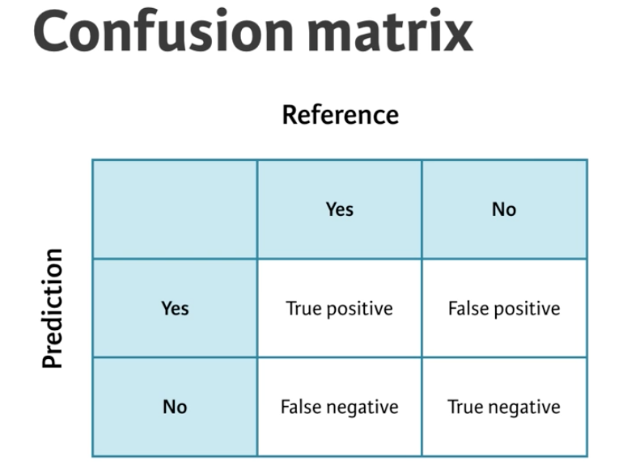
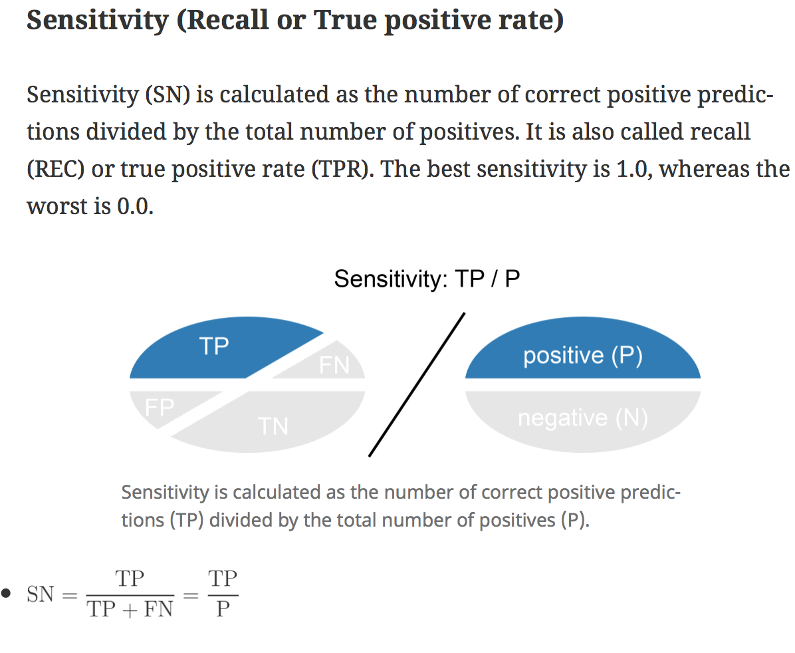
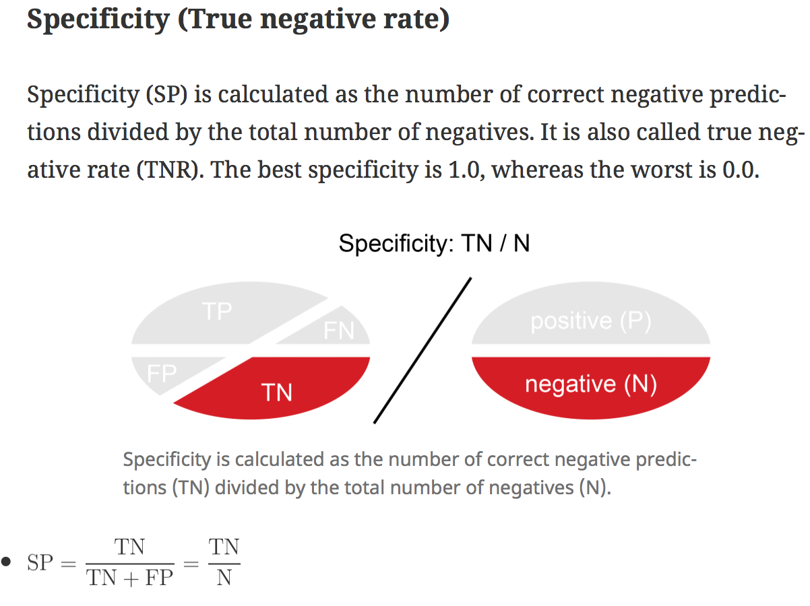

## Introduction
Let's first load the required libraries.

```{r message=FALSE, warning=FALSE}
source('libraries.R')
```
`caret` is the most widely used packages in R for `Supervised Learning` (aka Predictive modeling). Supervised Learning is machine learning when you have a target variable or something specific that you want to predict. The classic example of Supervised Learning is predicting what species an Iris is based on it's physical measurements. In this case, we have something specific that we want to predict on new data (i.e species).

There are two main kinds of predictive models:

* **Classification** -> predict Qualitative variables
* **Regression** -> predict Quantitative variables

Once we have a model, we can use a metric to evaluate how well our model works. For Regression models, we focus on the `RMSE` - our metric of choice, this is the error that our linear regression model seek to minimize. Unfortunately, it is a common practice to calculate the RMSE using the same data that we used to fit the model. This typically leads to over-optimistic model performance, what we call as `over-fitting`. A better approach is to use out-of-sample error to estimate the performance. This is the approach `caret` takes, because it simulates the case that happens in the real world and helps us avoid `over-fitting`. However, it is useful to calculate the in-sample error and then compare this to the out-of-sample error. 

## RMSE

`diamonds` dataset, which is a classic dataset from the ggplot2 package. The dataset contains physical attributes of diamonds as well as the price they sold for. One interesting modeling challenge is predicting diamond price based on their attributes using something like a linear regression.

```{r}
# Fit a linear model on the diamonds dataset predicting price using all the variables as predictors.
model <- lm(price ~ . , data = diamonds)
```

Make predictions using model on the full original dataset and save the result to p.

```{r}
p <- predict(model)
```

Compute the `errors = predicted - actual`. 
```{r}
error <- (p - diamonds$price)
```

Calculate the RMSE
```{r}
sqrt(mean(error^2))
```

### Out-of-sample Error.

One way you can take a train/test split of a dataset is to order the dataset randomly, then divide it into the two sets. This ensures that the training set and test set are both random samples and that any biases in the ordering of the dataset (e.g. if it had originally been ordered by price or size) are not retained in the samples we take for training and testing your models. You can think of this like shuffling a brand new deck of playing cards before dealing hands.

First, you set a random seed so that your work is reproducible and you get the same random split each time you run your script:c
```{r}
# Set seed
set.seed(42)

# Shuffle row indices: rows
rows <- sample(nrow(diamonds))

# Randomly order data
diamonds <- diamonds[rows,]
```

Now that your dataset is randomly ordered, you can split the first 80% of it into a training set, and the last 20% into a test set. You can do this by choosing a split point approximately 80% of the way through your data:

```{r}
# Determine row to split on: split
split <- round(nrow(diamonds) * .80)

# Create train
train <- diamonds[1:split,]

# Create test
test <- diamonds[(split+1):nrow(diamonds),]
```

Now that you have a randomly split training set and test set, you can use the lm() function as you did in the first exercise to fit a model to your training set, rather than the entire dataset. Recall that you can use the formula interface to the linear regression function to fit a model with a specified target variable using all other variables in the dataset as predictors. Next, you can use the predict() function to make predictions from that model on new data. The new dataset must have all of the columns from the training data, but they can be in a different order with different values. Here, rather than re-predicting on the training set, you can predict on the test set, which you did not use for training the model. This will allow you to determine the out-of-sample error for the model in the next exercise.

```{r}
# Fit lm model on train: model
model <- lm(price ~ . , train)

# Predict on test: p
p <- predict(model, test)
```

Now that you have predictions on the test set, you can use these predictions to calculate an error metric (in this case RMSE) on the test set and see how the model performs out-of-sample, rather than in-sample as you did in the first exercise. You first do this by calculating the errors between the predicted diamond prices and the actual diamond prices by subtracting the predictions from the actual values.

Once you have an error vector, calculating RMSE is as simple as squaring it, taking the mean, then taking the square root

```{r}
# Compute errors: error
error <- p - test$price

# Calculate RMSE
sqrt(mean(error ^2))
```

Moral of the story: `Computing the error on the training set is risky because the model may overfit the data used to train it.`

### Cross validation
A better approach to validating models is to use multiple systematic test sets, rather than a single random train/test split. Fortunately, the caret package makes this very easy to do. caret supports many types of cross-validation, and you can specify which type of cross-validation and the number of cross-validation folds with the trainControl() function, which you pass to the trControl argument in train(). It's important to note that you pass the method for modeling to the main train() function and the method for cross-validation to the trainControl() function.

```{r}
# Fit lm model using 10-fold CV: model
model <- train(
  price ~ ., diamonds,
  method = "lm",
  trControl = trainControl(
    method = "cv", number = 10,
    verboseIter = TRUE
  )
)

# Print model to console
model
```

## Classification models: fitting them and evaluating their performance

We'll fit classification models with train() and evaluate their out-of-sample performance using cross-validation and area under the curve (AUC).

We'll be working with the Sonar dataset in this chapter, using a 60% training set and a 40% test set. We'll practice making a train/test split one more time, just to be sure you have the hang of it. Recall that you can use the sample() function to get a random permutation of the row indices in a dataset, to use when making train/test splits, and then use those row indices to randomly reorder the dataset. Once your dataset is randomly ordered, you can split off the first 60% as a training set and the last 40% as a test set.

```{r}
# Sonar is part of mlbench package.
data(Sonar)

# Shuffle row indices: rows
rows <- sample(nrow(Sonar))

# Randomly order data: Sonar
Sonar <- Sonar[rows,]

# Identify row to split on: split
split <- round(nrow(Sonar) * .6)

# Create train
train <- Sonar[1:split,]

# Create test
test <- Sonar[(split + 1):nrow(Sonar),]
```

> TIP: HOW TO SPLIT A DATAFRAME INTO TRAIN TEST SPLIT IN R ?

Next, we will fit a logistic regression model:

Once you have your random training and test sets you can fit a logistic regression model to your training set using the glm() function. glm() is a more advanced version of lm() that allows for more varied types of regression models, aside from plain vanilla ordinary least squares regression.

Be sure to pass the argument family = "binomial" to glm() to specify that you want to do logistic (rather than linear) regression. 

Don't worry about warnings like glm.fit: algorithm did not converge or glm.fit: fitted probabilities numerically 0 or 1 occurred. These are common on smaller datasets and usually don't cause any issues. They typically mean your dataset is perfectly seperable, which can cause problems for the math behind the model, but R's glm() function is almost always robust enough to handle this case with no problems.

Once you have a glm() model fit to your dataset, you can predict the outcome (e.g. rock or mine) on the test set using the predict() function with the argument type = "response".

```{r}
# Fit glm model: model
model <- glm(Class ~ ., family = "binomial"(link = "logit"), data = train)

# Predict on test: p
p <- predict(model, test, type = "response")
```

## Confusion matrix

A confusion matrix is a very useful tool for calibrating the output of a model and examining all possible outcomes of your predictions (true positive, true negative, false positive, false negative).

Before you make your confusion matrix, you need to "cut" your predicted probabilities at a given threshold to turn probabilities into class predictions. You can do this easily with the ifelse() function

You could make such a contingency table with the table() function in base R, but confusionMatrix() in caret yields a lot of useful ancillary statistics in addition to the base rates in the table. You can calculate the confusion matrix (and the associated statistics) using the predicted outcomes as well as the actual outcomes. `confusionMatrix(predicted, actual)`

```{r}
# Calculate class probabilities: p_class
p_class <- ifelse(p > 0.5, "M", "R")

# Create confusion matrix
confusionMatrix(p_class, test$Class)
```




False positive: Predicting that you are pregnant when you are not.
False negative: Predicting that you are NOT pregnant when you are.

True positive: Predicting that you are pregnant when you are.
False negative: Predicting that you are not pregrant when you are not.

Theory: A really useful tool for evaluating binary classification models is known as a confusion matrix. This is a matrix of the model's predicted classes vs the actual outcomes in reality. The columns of the confusion matrix are the true classes and rows of the confusion matrix are the predicted classes. The main `diagnol` of the model are the cases when the model is correct. The second diagnol of the confusion matrix is the cases where the model is incorrect. 

True positives are the cases where the model correctly predicted YES.
False positives are the cases where the model incorrectly predicted YES.
False negatives are the cases where the model incorrectly predicted NO.
True negatives are the cases where the model correctly predicted NO.

All 4 of these outcomes are important when evaluating a predictive model's accuracy. 

Steps for generating a confusion matrix:

1. Fit a model to the training set
2. Next, we predict on the test set and cut the predicted probabilities with a threshold to get class assignments. In other words, the logistic regression model outputs a probability that the object is a Mine ("M") but we need to use these probabilities to make a "binary" decision - Mine "M" or Rock "R".
3. Turn probabilities into classes and look at their frequencies. In the simplest case, we use 50% as our cut-off and assign anything under 50% as a Rock and over 50% as a Mine. 
4. Next, we make a two-way frequency table. 

A confusion matrix is a very useful tool for calibrating the output of a model and examining all possible outcomes of your predictions (true positive, true negative, false positive, false negative).

Before you make your confusion matrix, you need to "cut" your predicted probabilities at a given threshold to turn probabilities into class predictions. You can do this easily with the ifelse() function.

You could make such a contingency table with the table() function in base R, but confusionMatrix() in caret yields a lot of useful ancillary statistics in addition to the base rates in the table. You can calculate the confusion matrix (and the associated statistics) using the predicted outcomes as well as the actual outcomes.

The confusion matrix is a two by two table that contains four outcomes produced by a binary classifier. Various measures, such as error-rate, accuracy, specificity, sensitivity, and precision, are derived from the confusion matrix. Moreover, several advanced measures, such as ROC and precision-recall, are based on them.


## Class probabilities and class predictions

Manually evaluating classification thresholds is hard work. In order to do this correctly, we have to manually calculate dozens or hundereds of confusion matrices and then visually inspect them and find one we like. This seems un-scientific and requires lots of manual work, is heuristic based, and can easily overlook a particular important threshold. We need a more systematic approach to evaluating classification thresholds. One common approach to this problem is to let the computer iteratively evaluate every possible classfication threshold and then calculate the `true positive rate` and `false positive rate` for each of them. We can then plot the `true positive rate` , `false positive rate` at each possible threshold and visualize the trade-off between two extreme models, i.e, predict all Mines vs predict all Rocks or (100% true positive rate vs 0% false positive rate). The resulting curve is called a `ROC` curve (read it as Rock-curve).

What is the primary value of an ROC curve?
It evaluates all possible thresholds for splitting predicted probabilities into predicted classes.

ROC curve is a really useful shortcut for summarizing the performance of a classifier over all possible thresholds. This saves you a lot of tedious work computing class predictions for many different thresholds and examining the confusion matrix for each. 

My favorite package for computing ROC curves is caTools, which contains a function called colAUC(). This function is very user-friendly and can actually calculate ROC curves for multiple predictors at once. In this case, you only need to calculate the ROC curve for one predictor.

The function will return a score called AUC (more on that later) and the plotROC = TRUE argument will return the plot of the ROC curve for visual inspection.

Predict probabilities (i.e. type = "response") on the test set, then store the result as p.

```{r}
# Predict on test: p
p <- predict(model, test, type = "response")

# Make ROC curve
colAUC(p, test$Class, plotROC = TRUE)
```

Ok, so now it is important to understand the two measures: Sensitivity and Specificity. 






## Area under the curve (AOC)

From ROC to AUC: Just by looking at the ROC curve starts to give us a good idea of how to evaluate whether or not our predictive model is any good. 

Area under the ROC curve is a very useful, single-number summary of a model's ability to discriminate the positive from the negative class (e.g. mines from rocks). An AUC of 0.5 is no better than random guessing, an AUC of 1.0 is a perfectly predictive model, and an AUC of 0.0 is perfectly anti-predictive (which rarely happens). This is often a much more useful metric than simply ranking models by their accuracy at a set threshold, as different models might require different calibration steps (looking at a confusion matrix at each step) to find the optimal classification threshold for that model.

You can use the trainControl() function in caret to use AUC (instead of acccuracy), to tune the parameters of your models. The twoClassSummary() convenience function allows you to do this easily.

When using twoClassSummary(), be sure to always include the argument classProbs = TRUE or your model will throw an error! (You cannot calculate AUC with just class predictions. You need to have class probabilities as well.)

```{r}
# Create trainControl object: myControl
# Customize the trainControl object to use twoClassSummary rather than defaultSummary.
myControl <- trainControl(
  method = "cv",
  number = 10,
  summaryFunction = twoClassSummary,
  classProbs = TRUE, # IMPORTANT!
  verboseIter = TRUE
)
```

Now that you have a custom trainControl object, it's easy to fit caret models that use AUC rather than accuracy to tune and evaluate the model. You can just pass your custom trainControl object to the train() function via the trControl argument.

This syntax gives you a convenient way to store a lot of custom modeling parameters and then use them across multiple different calls to train().

```{r warning=FALSE}
# Train glm with custom trainControl: model
model <- train(Class ~ ., method = "glm", 
                data = Sonar,
                trControl = myControl)


# Print model to console
model
```

## Random Forests

Random forest models are much more flexible than linear models, and can model complicated nonlinear effects as well as automatically capture interactions between variables. They tend to give very good results on real world data, so let's try one out on the wine quality dataset, where the goal is to predict the human-evaluated quality of a batch of wine, given some of the machine-measured chemical and physical properties of that batch.

Fitting a random forest model is exactly the same as fitting a generalized linear regression model, as you did in the previous chapter. You simply change the method argument in the train function to be "ranger". The ranger package is a rewrite of R's classic randomForest package and fits models much faster, but gives almost exactly the same results. We suggest that all beginners use the ranger package for random forest modeling.


Train a random forest called model on the wine quality dataset, wine, such that quality is the response variable and all other variables are explanatory variables.
Let's import the wine dataset.
```{r}
wine <- import("/Users/Shravan/Downloads/wine_100.RDS")
```

```{r}
# Fit random forest: model
model <- train(
  quality ~ .,
  tuneLength = 1,
  data = wine, method = "ranger",
  trControl = trainControl(method = "cv", number = 5, verboseIter = TRUE)
)

# Print model to console
model
```


