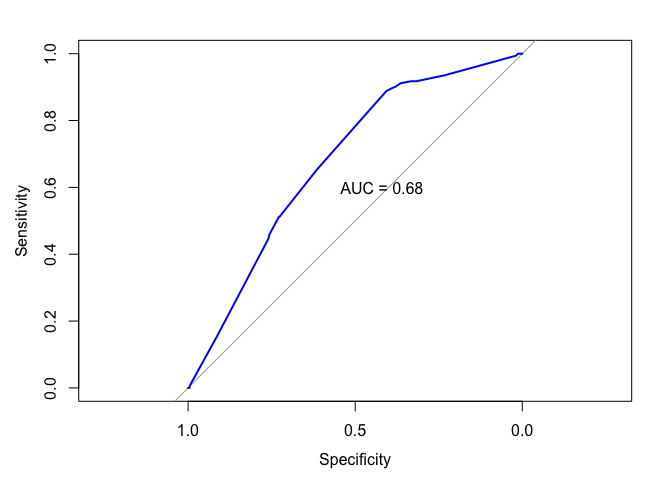

seismic.Rmd
================
Shravan Kuchkula
11/23/2017

-   [Introduction](#introduction)
-   [Getting the data](#getting-the-data)
-   [Exploratory Data Analysis](#exploratory-data-analysis)
    -   [How many observations are "hazardous state (class = 1)" and "non-hazardous state (class = 0)" ?](#how-many-observations-are-hazardous-state-class-1-and-non-hazardous-state-class-0)
-   [Logistic Regression Model](#logistic-regression-model)

Introduction
------------

Mining activity was and is always connected with the occurrence of dangers which are commonly called mining hazards. A special case of such threat is a seismic hazard which frequently occurs in many underground mines. Seismic hazard is the hardest detectable and predictable of natural hazards and in this respect it is comparable to an earthquake. More and more advanced seismic and seismoacoustic monitoring systems allow a better understanding rock mass processes and definition of seismic hazard prediction methods. Accuracy of so far created methods is however far from perfect. Complexity of seismic processes and big disproportion between the number of low-energy seismic events and the number of high-energy phenomena (e.g. &gt; 10^4J) causes the statistical techniques to be insufficient to predict seismic hazard.

The data describe the problem of high energy (higher than 10^4 J) seismic bumps forecasting in a coal mine. Data come from two of longwalls located in a Polish coal mine.

Getting the data
----------------

``` r
source("libraries.R")
```

``` r
#url <- "https://archive.ics.uci.edu/ml/machine-learning-databases/00266/seismic-bumps.arff"
#download.file(url, "seismic-bumps.arff")
seismicData <- import("seismic-bumps.arff")
glimpse(seismicData)
```

    ## Observations: 2,584
    ## Variables: 19
    ## $ seismic        <fctr> a, a, a, a, a, a, a, a, a, a, a, a, a, a, a, a...
    ## $ seismoacoustic <fctr> a, a, a, a, a, a, a, a, a, a, a, a, a, a, a, b...
    ## $ shift          <fctr> N, N, N, N, N, W, W, N, N, W, N, N, W, N, N, W...
    ## $ genergy        <dbl> 15180, 14720, 8050, 28820, 12640, 63760, 207930...
    ## $ gpuls          <dbl> 48, 33, 30, 171, 57, 195, 614, 194, 303, 675, 1...
    ## $ gdenergy       <dbl> -72, -70, -81, -23, -63, -73, -6, -27, 54, 4, -...
    ## $ gdpuls         <dbl> -72, -79, -78, 40, -52, -65, 18, -3, 52, 25, -3...
    ## $ ghazard        <fctr> a, a, a, a, a, a, a, a, a, a, a, a, a, a, a, a...
    ## $ nbumps         <dbl> 0, 1, 0, 1, 0, 0, 2, 1, 0, 1, 1, 0, 1, 1, 1, 2,...
    ## $ nbumps2        <dbl> 0, 0, 0, 0, 0, 0, 2, 0, 0, 1, 0, 0, 1, 0, 1, 0,...
    ## $ nbumps3        <dbl> 0, 1, 0, 1, 0, 0, 0, 1, 0, 0, 1, 0, 0, 1, 0, 2,...
    ## $ nbumps4        <dbl> 0, 0, 0, 0, 0, 0, 0, 0, 0, 0, 0, 0, 0, 0, 0, 0,...
    ## $ nbumps5        <dbl> 0, 0, 0, 0, 0, 0, 0, 0, 0, 0, 0, 0, 0, 0, 0, 0,...
    ## $ nbumps6        <dbl> 0, 0, 0, 0, 0, 0, 0, 0, 0, 0, 0, 0, 0, 0, 0, 0,...
    ## $ nbumps7        <dbl> 0, 0, 0, 0, 0, 0, 0, 0, 0, 0, 0, 0, 0, 0, 0, 0,...
    ## $ nbumps89       <dbl> 0, 0, 0, 0, 0, 0, 0, 0, 0, 0, 0, 0, 0, 0, 0, 0,...
    ## $ energy         <dbl> 0, 2000, 0, 3000, 0, 0, 1000, 4000, 0, 500, 500...
    ## $ maxenergy      <dbl> 0, 2000, 0, 3000, 0, 0, 700, 4000, 0, 500, 5000...
    ## $ class          <fctr> 0, 0, 0, 0, 0, 0, 0, 0, 0, 0, 0, 0, 0, 0, 0, 0...

Exploratory Data Analysis
-------------------------

### How many observations are "hazardous state (class = 1)" and "non-hazardous state (class = 0)" ?

``` r
table(seismicData$class)
```

    ## 
    ##    0    1 
    ## 2414  170

Logistic Regression Model
-------------------------

Fit a logistic regression model with what you think could be contributing to the seismic hazard.

``` r
seismic_model <- glm(class ~ seismic + seismoacoustic + shift + ghazard,
                     data = seismicData, family = "binomial")

summary(seismic_model)
```

    ## 
    ## Call:
    ## glm(formula = class ~ seismic + seismoacoustic + shift + ghazard, 
    ##     family = "binomial", data = seismicData)
    ## 
    ## Deviance Residuals: 
    ##     Min       1Q   Median       3Q      Max  
    ## -0.6757  -0.4321  -0.3998  -0.1856   2.9426  
    ## 
    ## Coefficients:
    ##                  Estimate Std. Error z value Pr(>|z|)    
    ## (Intercept)      -4.05310    0.25427 -15.940  < 2e-16 ***
    ## seismicb          0.42551    0.16421   2.591  0.00956 ** 
    ## seismoacousticb   0.05025    0.17474   0.288  0.77369    
    ## seismoacousticc   0.70002    0.67220   1.041  0.29770    
    ## shiftW            1.56663    0.26392   5.936 2.92e-09 ***
    ## ghazardb         -0.31343    0.32304  -0.970  0.33192    
    ## ghazardc        -14.38103  424.95947  -0.034  0.97300    
    ## ---
    ## Signif. codes:  0 '***' 0.001 '**' 0.01 '*' 0.05 '.' 0.1 ' ' 1
    ## 
    ## (Dispersion parameter for binomial family taken to be 1)
    ## 
    ##     Null deviance: 1253.8  on 2583  degrees of freedom
    ## Residual deviance: 1178.9  on 2577  degrees of freedom
    ## AIC: 1192.9
    ## 
    ## Number of Fisher Scoring iterations: 15

Making a binary prediction: We used the glm() function to build a logistic regression model of the `class` variable. As with many of R's machine learning methods, you can apply the `predict()` function to the model object to forecast future behavior. By default, predict() outputs predictions in terms of log odds unless `type = "response"` is specified. This converts the log odds to probabilities.

Because a logistic regression model estimates the probability of the outcome, it is up to you to determine the threshold at which the probability implies action. One must balance the extremes of being too cautious versus being too aggressive. For example, if we classify an observation which has a probability of being in class 1 as 99% or greater, then we may miss out on some observations that may indeed be class 1 but were classified as class 0. This balance is particularly important to consider for severely imbalanced outcomes, such as in this dataset where class 1 are relatively rare.

``` r
# make a copy
seismicDataPredictions <- seismicData

# Estimate the probability of class 1
seismicDataPredictions$prob <- predict(seismic_model, type = "response")
```

Find the actual probability of an observation to be in class 1.

``` r
mean(as.numeric(as.character(seismicData$class)))
```

    ## [1] 0.06578947

We will use this as our cut-off threshold.

``` r
seismicDataPredictions$pred <- ifelse(seismicDataPredictions$prob > 0.0657, 1, 0)
```

Now calculate the model accuracy:

``` r
mean(seismicDataPredictions$pred == seismicDataPredictions$class)
```

    ## [1] 0.4384675

This shows that the logistic regression model with all the factor variables made a correct prediction 44% of the time.

What would be the accuracy of the model if a model had simply predicted class 0 for each observation ?

``` r
seismicDataPredictions$predNull <- 0
mean(seismicDataPredictions$predNull == seismicDataPredictions$class)
```

    ## [1] 0.9342105

With an accuracy of 44% the model is actually performing worse than if it were to predict class 0 for every record.

This illustrates that "rare events" create challenges for classification models. When 1 outcome is very rare predicting the opposite can result in very high accuracy.

Calculate ROC Curves and AUC: The previous exercises have demonstrated that accuracy is a very misleading measure of model performance on imbalanced datasets. Graphing the model's performance better illustrates the tradeoff between a model that is overly agressive and one that is overly passive. Here we will create a ROC curve and compute the area under the curve (AUC) to evaluate the logistic regression model that we created above.

``` r
ROC <- roc(seismicDataPredictions$class, seismicDataPredictions$prob)
plot(ROC, col = "blue")
text(x = .42, y = .6,paste("AUC = ", round(auc(ROC), 2), sep = ""))
```



Dummy variables, missing data and interactions:

``` r
seismic_model <- glm(class ~ seismic + seismoacoustic + shift + ghazard,
                     data = seismicData, family = "binomial")
```
