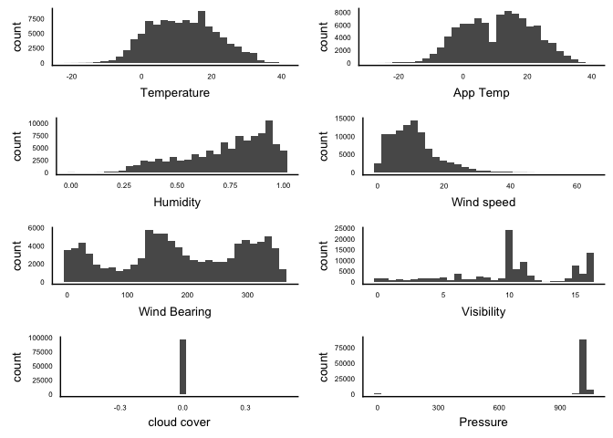
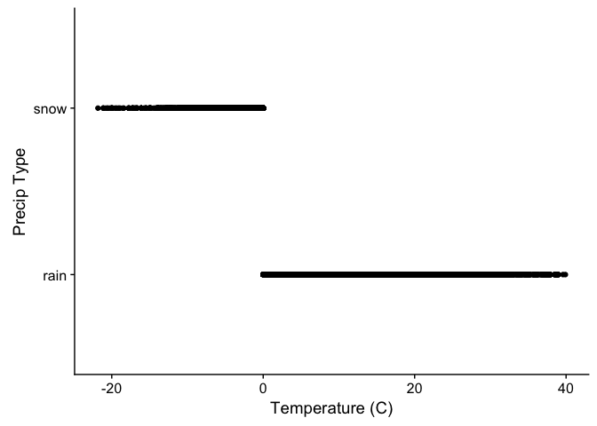

Weather.Rmd
================
Shravan Kuchkula
12/4/2017

-   [Introduction](#introduction)
-   [Getting the data](#getting-the-data)

Introduction
------------

Weather dataset from Kaggle

Getting the data
----------------

``` r
source('libraries.R')
```

    ## Loading required package: readr

    ## Loading required package: dplyr

    ## 
    ## Attaching package: 'dplyr'

    ## The following objects are masked from 'package:stats':
    ## 
    ##     filter, lag

    ## The following objects are masked from 'package:base':
    ## 
    ##     intersect, setdiff, setequal, union

    ## Loading required package: tidyr

    ## Loading required package: ggplot2

    ## Loading required package: magrittr

    ## 
    ## Attaching package: 'magrittr'

    ## The following object is masked from 'package:tidyr':
    ## 
    ##     extract

    ## Loading required package: markdown

    ## Loading required package: knitr

    ## Loading required package: yaml

    ## Loading required package: corrplot

    ## Loading required package: GGally

    ## 
    ## Attaching package: 'GGally'

    ## The following object is masked from 'package:dplyr':
    ## 
    ##     nasa

    ## Loading required package: broom

    ## Loading required package: psych

    ## 
    ## Attaching package: 'psych'

    ## The following objects are masked from 'package:ggplot2':
    ## 
    ##     %+%, alpha

    ## Loading required package: car

    ## 
    ## Attaching package: 'car'

    ## The following object is masked from 'package:psych':
    ## 
    ##     logit

    ## The following object is masked from 'package:dplyr':
    ## 
    ##     recode

    ## Loading required package: vtreat

    ## Loading required package: caret

    ## Loading required package: lattice

    ## Loading required package: mlbench

    ## Loading required package: caTools

    ## Loading required package: rio

    ## Loading required package: ranger

    ## Loading required package: pROC

    ## Type 'citation("pROC")' for a citation.

    ## 
    ## Attaching package: 'pROC'

    ## The following objects are masked from 'package:stats':
    ## 
    ##     cov, smooth, var

    ## Loading required package: reshape2

    ## 
    ## Attaching package: 'reshape2'

    ## The following object is masked from 'package:tidyr':
    ## 
    ##     smiths

    ## Loading required package: cowplot

    ## 
    ## Attaching package: 'cowplot'

    ## The following object is masked from 'package:ggplot2':
    ## 
    ##     ggsave

``` r
weather <- read_csv("/Users/Shravan/Downloads/weatherHistory.csv")
```

    ## Parsed with column specification:
    ## cols(
    ##   `Formatted Date` = col_character(),
    ##   Summary = col_character(),
    ##   `Precip Type` = col_character(),
    ##   `Temperature (C)` = col_double(),
    ##   `Apparent Temperature (C)` = col_double(),
    ##   Humidity = col_double(),
    ##   `Wind Speed (km/h)` = col_double(),
    ##   `Wind Bearing (degrees)` = col_double(),
    ##   `Visibility (km)` = col_double(),
    ##   `Loud Cover` = col_double(),
    ##   `Pressure (millibars)` = col_double(),
    ##   `Daily Summary` = col_character()
    ## )

``` r
glimpse(weather)
```

    ## Observations: 96,453
    ## Variables: 12
    ## $ Formatted Date           <chr> "2006-04-01 00:00:00.000 +0200", "200...
    ## $ Summary                  <chr> "Partly Cloudy", "Partly Cloudy", "Mo...
    ## $ Precip Type              <chr> "rain", "rain", "rain", "rain", "rain...
    ## $ Temperature (C)          <dbl> 9.472222, 9.355556, 9.377778, 8.28888...
    ## $ Apparent Temperature (C) <dbl> 7.388889, 7.227778, 9.377778, 5.94444...
    ## $ Humidity                 <dbl> 0.89, 0.86, 0.89, 0.83, 0.83, 0.85, 0...
    ## $ Wind Speed (km/h)        <dbl> 14.1197, 14.2646, 3.9284, 14.1036, 11...
    ## $ Wind Bearing (degrees)   <dbl> 251, 259, 204, 269, 259, 258, 259, 26...
    ## $ Visibility (km)          <dbl> 15.8263, 15.8263, 14.9569, 15.8263, 1...
    ## $ Loud Cover               <dbl> 0, 0, 0, 0, 0, 0, 0, 0, 0, 0, 0, 0, 0...
    ## $ Pressure (millibars)     <dbl> 1015.13, 1015.63, 1015.94, 1016.41, 1...
    ## $ Daily Summary            <chr> "Partly cloudy throughout the day.", ...

Check the cardinality of all character variables to get an idea about which one we can use as a class variable.

``` r
getUniqueValues <- function(x){
  levels(as.factor(x))
}
weather %>%
  select(starts_with("Formatted"), contains("Summary"), contains("Precip")) %>%
  sapply(getUniqueValues) %>%
  lapply(length) %>%
  glimpse()
```

    ## List of 4
    ##  $ Formatted Date: int 96429
    ##  $ Summary       : int 27
    ##  $ Daily Summary : int 214
    ##  $ Precip Type   : int 3

`Precip Type` looks like a good class variable. Let's check how the values are distributed for this variable.

``` r
table(as.factor(weather$`Precip Type`))
```

    ## 
    ##  null  rain  snow 
    ##   517 85224 10712

Clean the rows where `Precip Type` is not present.

``` r
table(as.factor(as.character(weather$`Loud Cover`)))
```

    ## 
    ##     0 
    ## 96453

``` r
weatherFilter <- weather %>%
                    filter(`Precip Type` != "null")
```

``` r
weather %>%
  select(contains("Temp"), contains("Wind"), Humidity, `Visibility (km)`, `Loud Cover`, `Pressure (millibars)`) %>%
  summary()
```

    ##  Temperature (C)   Apparent Temperature (C) Wind Speed (km/h)
    ##  Min.   :-21.822   Min.   :-27.717          Min.   : 0.000   
    ##  1st Qu.:  4.689   1st Qu.:  2.311          1st Qu.: 5.828   
    ##  Median : 12.000   Median : 12.000          Median : 9.966   
    ##  Mean   : 11.933   Mean   : 10.855          Mean   :10.811   
    ##  3rd Qu.: 18.839   3rd Qu.: 18.839          3rd Qu.:14.136   
    ##  Max.   : 39.906   Max.   : 39.344          Max.   :63.853   
    ##  Wind Bearing (degrees)    Humidity      Visibility (km)   Loud Cover
    ##  Min.   :  0.0          Min.   :0.0000   Min.   : 0.00   Min.   :0   
    ##  1st Qu.:116.0          1st Qu.:0.6000   1st Qu.: 8.34   1st Qu.:0   
    ##  Median :180.0          Median :0.7800   Median :10.05   Median :0   
    ##  Mean   :187.5          Mean   :0.7349   Mean   :10.35   Mean   :0   
    ##  3rd Qu.:290.0          3rd Qu.:0.8900   3rd Qu.:14.81   3rd Qu.:0   
    ##  Max.   :359.0          Max.   :1.0000   Max.   :16.10   Max.   :0   
    ##  Pressure (millibars)
    ##  Min.   :   0        
    ##  1st Qu.:1012        
    ##  Median :1016        
    ##  Mean   :1003        
    ##  3rd Qu.:1021        
    ##  Max.   :1046

``` r
library(cowplot)

histGrid <- function(v, varName){
  
 p <- weather %>%
        ggplot(aes(x = v)) +
        geom_histogram() +
        xlab(varName) +
        theme(axis.text.y = element_text(size = 6), axis.text.x = element_text(size = 6),
        axis.title.y = element_text(size = 10), axis.title.x = element_text(size = 10),
        axis.ticks = element_blank())
  
}

p1 <- histGrid(weather$`Temperature (C)`, "Temperature")
p2 <- histGrid(weather$`Apparent Temperature (C)`, "App Temp")
p3 <- histGrid(weather$Humidity, "Humidity")
p4 <- histGrid(weather$`Wind Speed (km/h)`, "Wind speed")
p5 <- histGrid(weather$`Wind Bearing (degrees)`, "Wind Bearing")
p6 <- histGrid(weather$`Visibility (km)`, "Visibility")
p7 <- histGrid(weather$`Loud Cover`, "cloud cover")
p8 <- histGrid(weather$`Pressure (millibars)`, "Pressure")

plot_grid(p1, p2, p3, p4, p5, p6, p7, p8, ncol = 2)
```

    ## `stat_bin()` using `bins = 30`. Pick better value with `binwidth`.
    ## `stat_bin()` using `bins = 30`. Pick better value with `binwidth`.
    ## `stat_bin()` using `bins = 30`. Pick better value with `binwidth`.
    ## `stat_bin()` using `bins = 30`. Pick better value with `binwidth`.
    ## `stat_bin()` using `bins = 30`. Pick better value with `binwidth`.
    ## `stat_bin()` using `bins = 30`. Pick better value with `binwidth`.
    ## `stat_bin()` using `bins = 30`. Pick better value with `binwidth`.
    ## `stat_bin()` using `bins = 30`. Pick better value with `binwidth`.



``` r
detach("package:cowplot", character.only = TRUE)
```

``` r
weatherFilter %>%
  ggplot(aes(x = `Temperature (C)` , y = `Precip Type`)) + 
  geom_point()
```


