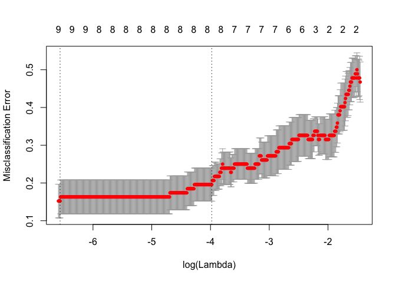
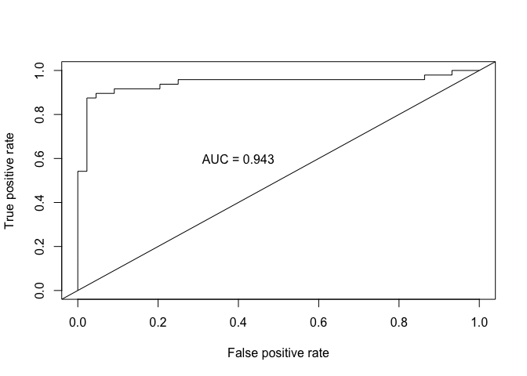
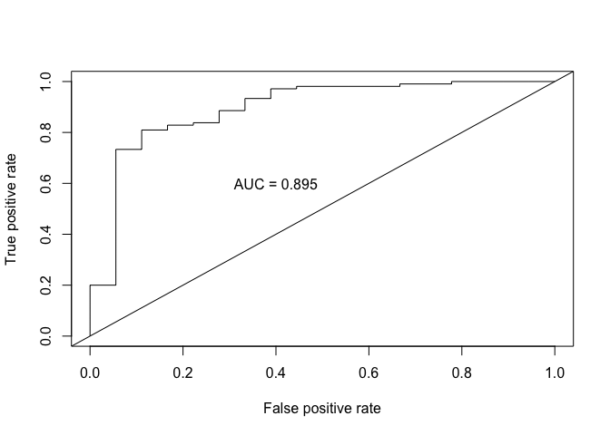
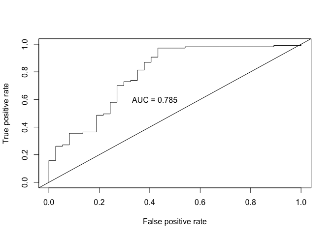
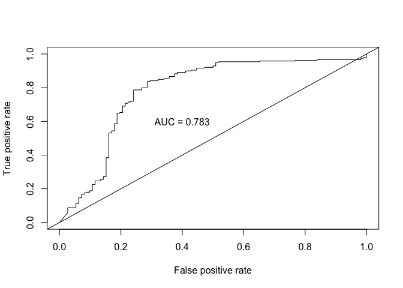

Using glmnet
================
Shravan Kuchkula
11/19/2017

-   [Getting the data](#getting-the-data)
-   [glmnet](#glmnet)
    -   [Training Set](#training-set)
    -   [Validation Set I](#validation-set-i)
    -   [Validation Set II](#validation-set-ii)
    -   [Validation Set III](#validation-set-iii)
-   [LDA](#lda)

Getting the data
----------------

Import the necessary libraries

``` r
# Load all the libraries
installRequiredPackages <- function(pkg){
  new.pkg <- pkg[!(pkg %in% installed.packages()[,"Package"])]
  if (length(new.pkg))
    install.packages(new.pkg, dependencies = TRUE)
  sapply(pkg, require, character.only = TRUE)
}

libs <- c("readr", "dplyr", "tidyr", "ggplot2",
          "glmnet", "ROCR", "MASS"
          )

installRequiredPackages(libs)
```

    ##   readr   dplyr   tidyr ggplot2  glmnet    ROCR    MASS 
    ##    TRUE    TRUE    TRUE    TRUE    TRUE    TRUE    TRUE

Importing the dataset:

``` r
dat <- read.csv("/Users/Shravan/Downloads/Rexample/CancerExample.csv", header = TRUE)
```

Lets take a peak:

``` r
glimpse(dat)
```

    ## Observations: 710
    ## Variables: 14
    ## $ X      <int> 3, 4, 5, 6, 7, 8, 9, 10, 11, 12, 13, 14, 15, 16, 17, 18...
    ## $ Set    <fctr> Training, Training, Training, Training, Training, Trai...
    ## $ Cohort <fctr> Training Cancer, Training Cancer, Training Cancer, Tra...
    ## $ No     <int> 3, 4, 5, 6, 7, 8, 9, 10, 11, 12, 13, 14, 15, 16, 17, 18...
    ## $ Censor <int> 1, 1, 1, 1, 1, 1, 1, 1, 1, 1, 1, 1, 1, 1, 1, 1, 1, 1, 1...
    ## $ V1     <dbl> 102.259, 110.415, 118.051, 112.506, 106.437, 110.746, 1...
    ## $ V2     <dbl> 124.664, 136.268, 139.745, 132.449, 134.123, 129.957, 1...
    ## $ V3     <dbl> 103.400, 102.570, 104.439, 104.609, 103.517, 103.303, 1...
    ## $ V4     <dbl> 112.696, 113.661, 101.719, 118.067, 112.575, 112.440, 1...
    ## $ V5     <dbl> 100.125, 100.291, 101.013, 100.334, 100.501, 100.306, 1...
    ## $ V6     <dbl> 149.494, 115.294, 114.360, 126.537, 111.032, 111.918, 1...
    ## $ V7     <dbl> 100.621, 101.316, 101.917, 101.303, 101.138, 100.323, 1...
    ## $ V8     <dbl> 107.191, 102.108, 101.834, 103.651, 105.840, 101.670, 1...
    ## $ V9     <dbl> 101.653, 100.383, 100.159, 100.292, 100.403, 100.115, 1...

Do some EDA, there are 2 factor variables: `Set` and `Cohort`. Let's see how the values are distributed amoungst the levels of these factors.

``` r
# How many levels of Set variable and the distribution of values ?
table(dat$Set)
```

    ## 
    ##       Training   Validation I  Validation II Validation III 
    ##             92            123            144            351

``` r
# How many levels of Cohort variable and the distribution of values ?
table(dat$Cohort)
```

    ## 
    ##        Training Cancer       Training Healthy    Validation I Cancer 
    ##                     48                     44                    105 
    ##   Validation I Healthy   Validation II Cancer  Validation II Healthy 
    ##                     18                    107                     37 
    ##  Validation III Cancer Validation III Healthy 
    ##                    239                    112

glmnet
------

### Training Set

Let's pull the Training data from the df `dat`

``` r
#Get Training Set
dat.train <- dat[which(dat$Set == "Training"),]
```

> which returns the indicies of the data frame where data$Set == "Training", you then pass those indices to the dat dataframe to extract the Training dataset.

``` r
which(dat$Set == "Training")
```

    ##  [1]  1  2  3  4  5  6  7  8  9 10 11 12 13 14 15 16 17 18 19 20 21 22 23
    ## [24] 24 25 26 27 28 29 30 31 32 33 34 35 36 37 38 39 40 41 42 43 44 45 46
    ## [47] 47 48 49 50 51 52 53 54 55 56 57 58 59 60 61 62 63 64 65 66 67 68 69
    ## [70] 70 71 72 73 74 75 76 77 78 79 80 81 82 83 84 85 86 87 88 89 90 91 92

The next thing to do is to get all the numeric variables out of this training data frame. If you look at the glimpse output above, you will notice that variables with indices 6 to end are the numeric variables we are interested in.

``` r
dat.train.x <- dat.train[,6:ncol(dat.train)]
```

Next, it appears that `Censor` variable can only take values 0 and 1

``` r
sum(dat$Censor == 1) + sum(dat$Censor == 0)
```

    ## [1] 710

``` r
nrow(dat)
```

    ## [1] 710

OK, so let's put that into a vector of it's own and convert that into a factor:

``` r
dat.train.y <- dat.train$Censor
dat.train.y <- as.factor(as.character(dat.train.y))
table(dat.train.y)
```

    ## dat.train.y
    ##  0  1 
    ## 44 48

Next, since glmnet requires a matrix of predictors, let's convert that dataframe to matrix

``` r
dat.train.x <- as.matrix(dat.train.x)
```

Ok, so we are ready now to invoke the `cv.glmnet` function. (Wierd Syntax!)

``` r
cvfit <- cv.glmnet(dat.train.x, dat.train.y, family = "binomial", 
                   type.measure = "class", nlambda = 1000)

#plot it
plot(cvfit)
```



Next, lets get the `coef` of this cvfit object.

``` r
coef(cvfit, s = "lambda.min")
```

    ## 10 x 1 sparse Matrix of class "dgCMatrix"
    ##                        1
    ## (Intercept) 242.56891301
    ## V1            0.23749623
    ## V2            0.08986324
    ## V3           -0.07860983
    ## V4            0.07107904
    ## V5           -2.36991865
    ## V6            0.10341019
    ## V7           -1.04211799
    ## V8            0.29007330
    ## V9            0.21691323

``` r
#Get training set predictions...We know they are biased but lets create ROC's.
#These are predicted probabilities from logistic model  exp(b)/(1+exp(b))
fit.pred <- predict(cvfit, newx = dat.train.x, type = "response")
#Compare the prediction to the real outcome
head(fit.pred)
```

    ##           1
    ## 1 0.8261717
    ## 2 0.5529250
    ## 3 0.5432194
    ## 4 0.7493128
    ## 5 0.4378749
    ## 6 0.4870482

``` r
head(dat.train.y)
```

    ## [1] 1 1 1 1 1 1
    ## Levels: 0 1

Create ROC curve

``` r
#Create ROC curves
pred <- prediction(fit.pred[,1], dat.train.y)
roc.perf = performance(pred, measure = "tpr", x.measure = "fpr")
auc.train <- performance(pred, measure = "auc")
auc.train <- auc.train@y.values

#Plot ROC
plot(roc.perf)
abline(a=0, b= 1) #Ref line indicating poor performance
text(x = .40, y = .6,paste("AUC = ", round(auc.train[[1]],3), sep = ""))
```



### Validation Set I

Repeat the same steps on Validation Set I

``` r
#Get Validation Set I
dat.val1 <- dat[which(dat$Set == "Validation I"),]
dat.val1.x <- dat.val1[,c(6:ncol(dat))]
dat.val1.x <- as.matrix(dat.val1.x)

dat.val1.y <- dat.val1$Censor
dat.val1.y <- as.factor(as.character(dat.val1.y))
```

Run the model

``` r
#Run model from training set on valid set I
fit.pred1 <- predict(cvfit, newx = dat.val1.x, type = "response")
```

Check the model:

``` r
#ROC curves
pred1 <- prediction(fit.pred1[,1], dat.val1.y)
roc.perf1 = performance(pred1, measure = "tpr", x.measure = "fpr")
auc.val1 <- performance(pred1, measure = "auc")
auc.val1 <- auc.val1@y.values
plot(roc.perf1)
abline(a=0, b= 1)
text(x = .40, y = .6,paste("AUC = ", round(auc.val1[[1]],3), sep = ""))
```



### Validation Set II

Repeat the same for Validation Set II:

``` r
dat.val2 <- dat[which(dat$Set == "Validation II"),]
dat.val2.x <- dat.val2[,c(6:ncol(dat))]
dat.val2.x <- as.matrix(dat.val2.x)

dat.val2.y <- dat.val2$Censor
dat.val2.y <- as.factor(as.character(dat.val2.y))
```

Run the model:

``` r
fit.pred2 <- predict(cvfit, newx = dat.val2.x, type = "response")
```

Check the model:

``` r
pred2 <- prediction(fit.pred2[,1], dat.val2.y)
roc.perf2 = performance(pred2, measure = "tpr", x.measure = "fpr")
auc.val2 <- performance(pred2, measure = "auc")
auc.val2 <- auc.val2@y.values
plot(roc.perf2)
abline(a=0, b= 1)
text(x = .42, y = .6,paste("AUC = ", round(auc.val2[[1]],3), sep = ""))
```



### Validation Set III

Repeat the same for Validation Set III:

``` r
dat.val3 <- dat[which(dat$Set == "Validation III"),]
dat.val3.x <- dat.val3[,c(6:ncol(dat))]
dat.val3.x <- as.matrix(dat.val3.x)

dat.val3.y <- dat.val3$Censor
dat.val3.y <- as.factor(as.character(dat.val3.y))
```

Run the model:

``` r
fit.pred3 <- predict(cvfit, newx = dat.val3.x, type = "response")
```

Check the model:

``` r
pred3 <- prediction(fit.pred3[,1], dat.val3.y)
roc.perf3 = performance(pred3, measure = "tpr", x.measure = "fpr")
auc.val3 <- performance(pred3, measure = "auc")
auc.val3 <- auc.val3@y.values
plot(roc.perf3)
abline(a=0, b= 1)
text(x = .4, y = .6,paste("AUC = ", round(auc.val3[[1]],3), sep = ""))
```



LDA
---
