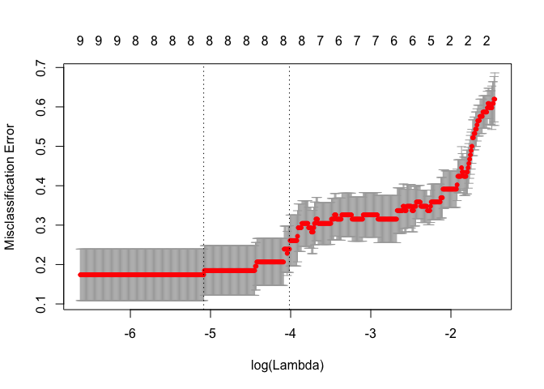
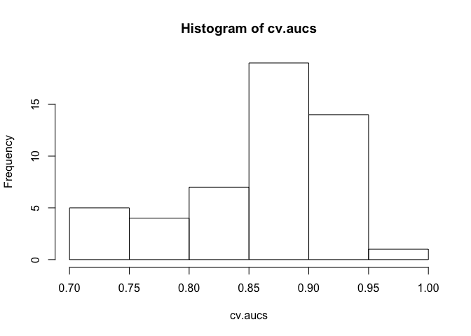

Using glmnet
================
Shravan Kuchkula
11/19/2017

-   [Getting the data](#getting-the-data)
-   [glmnet](#glmnet)
    -   [Training Set](#training-set)
    -   [Validation Set I](#validation-set-i)
    -   [Validation Set II](#validation-set-ii)
    -   [Validation Set III](#validation-set-iii)
-   [LDA](#lda)
    -   [Test/Train Split](#testtrain-split)
    -   [Validation I](#validation-i)
    -   [Validation II](#validation-ii)
    -   [Validation III](#validation-iii)
-   [Cross Validation](#cross-validation)
-   [Cross-Validation with random shuffle of response variable](#cross-validation-with-random-shuffle-of-response-variable)
-   [Learning more about glmnet](#learning-more-about-glmnet)

Getting the data
----------------

Import the necessary libraries

``` r
# Load all the libraries
installRequiredPackages <- function(pkg){
  new.pkg <- pkg[!(pkg %in% installed.packages()[,"Package"])]
  if (length(new.pkg))
    install.packages(new.pkg, dependencies = TRUE)
  sapply(pkg, require, character.only = TRUE)
}

libs <- c("readr", "dplyr", "tidyr", "ggplot2",
          "glmnet", "ROCR", "MASS"
          )

installRequiredPackages(libs)
```

    ##   readr   dplyr   tidyr ggplot2  glmnet    ROCR    MASS 
    ##    TRUE    TRUE    TRUE    TRUE    TRUE    TRUE    TRUE

Importing the dataset:

``` r
dat <- read.csv("/Users/Shravan/Downloads/Rexample/CancerExample.csv", header = TRUE)
```

Lets take a peak:

``` r
glimpse(dat)
```

    ## Observations: 710
    ## Variables: 14
    ## $ X      <int> 3, 4, 5, 6, 7, 8, 9, 10, 11, 12, 13, 14, 15, 16, 17, 18...
    ## $ Set    <fctr> Training, Training, Training, Training, Training, Trai...
    ## $ Cohort <fctr> Training Cancer, Training Cancer, Training Cancer, Tra...
    ## $ No     <int> 3, 4, 5, 6, 7, 8, 9, 10, 11, 12, 13, 14, 15, 16, 17, 18...
    ## $ Censor <int> 1, 1, 1, 1, 1, 1, 1, 1, 1, 1, 1, 1, 1, 1, 1, 1, 1, 1, 1...
    ## $ V1     <dbl> 102.259, 110.415, 118.051, 112.506, 106.437, 110.746, 1...
    ## $ V2     <dbl> 124.664, 136.268, 139.745, 132.449, 134.123, 129.957, 1...
    ## $ V3     <dbl> 103.400, 102.570, 104.439, 104.609, 103.517, 103.303, 1...
    ## $ V4     <dbl> 112.696, 113.661, 101.719, 118.067, 112.575, 112.440, 1...
    ## $ V5     <dbl> 100.125, 100.291, 101.013, 100.334, 100.501, 100.306, 1...
    ## $ V6     <dbl> 149.494, 115.294, 114.360, 126.537, 111.032, 111.918, 1...
    ## $ V7     <dbl> 100.621, 101.316, 101.917, 101.303, 101.138, 100.323, 1...
    ## $ V8     <dbl> 107.191, 102.108, 101.834, 103.651, 105.840, 101.670, 1...
    ## $ V9     <dbl> 101.653, 100.383, 100.159, 100.292, 100.403, 100.115, 1...

Do some EDA, there are 2 factor variables: `Set` and `Cohort`. Let's see how the values are distributed amoungst the levels of these factors.

``` r
# How many levels of Set variable and the distribution of values ?
table(dat$Set)
```

    ## 
    ##       Training   Validation I  Validation II Validation III 
    ##             92            123            144            351

``` r
# How many levels of Cohort variable and the distribution of values ?
table(dat$Cohort)
```

    ## 
    ##        Training Cancer       Training Healthy    Validation I Cancer 
    ##                     48                     44                    105 
    ##   Validation I Healthy   Validation II Cancer  Validation II Healthy 
    ##                     18                    107                     37 
    ##  Validation III Cancer Validation III Healthy 
    ##                    239                    112

glmnet
------

### Training Set

Let's pull the Training data from the df `dat`

``` r
#Get Training Set
dat.train <- dat[which(dat$Set == "Training"),]
```

> which returns the indicies of the data frame where data$Set == "Training", you then pass those indices to the dat dataframe to extract the Training dataset.

``` r
which(dat$Set == "Training")
```

    ##  [1]  1  2  3  4  5  6  7  8  9 10 11 12 13 14 15 16 17 18 19 20 21 22 23
    ## [24] 24 25 26 27 28 29 30 31 32 33 34 35 36 37 38 39 40 41 42 43 44 45 46
    ## [47] 47 48 49 50 51 52 53 54 55 56 57 58 59 60 61 62 63 64 65 66 67 68 69
    ## [70] 70 71 72 73 74 75 76 77 78 79 80 81 82 83 84 85 86 87 88 89 90 91 92

The next thing to do is to get all the numeric variables out of this training data frame. If you look at the glimpse output above, you will notice that variables with indices 6 to end are the numeric variables we are interested in.

``` r
dat.train.x <- dat.train[,6:ncol(dat.train)]
```

Next, it appears that `Censor` variable can only take values 0 and 1

``` r
sum(dat$Censor == 1) + sum(dat$Censor == 0)
```

    ## [1] 710

``` r
nrow(dat)
```

    ## [1] 710

OK, so let's put that into a vector of it's own and convert that into a factor:

``` r
dat.train.y <- dat.train$Censor
dat.train.y <- as.factor(as.character(dat.train.y))
table(dat.train.y)
```

    ## dat.train.y
    ##  0  1 
    ## 44 48

Next, since glmnet requires a matrix of predictors, let's convert that dataframe to matrix

``` r
dat.train.x <- as.matrix(dat.train.x)
```

Ok, so we are ready now to invoke the `cv.glmnet` function. (Wierd Syntax!)

``` r
cvfit <- cv.glmnet(dat.train.x, dat.train.y, family = "binomial", 
                   type.measure = "class", nlambda = 1000)

#plot it
plot(cvfit)
```



Next, lets get the `coef` of this cvfit object.

``` r
coef(cvfit, s = "lambda.min")
```

    ## 10 x 1 sparse Matrix of class "dgCMatrix"
    ##                        1
    ## (Intercept) 138.87734316
    ## V1            0.18079199
    ## V2            0.06770979
    ## V3            .         
    ## V4            0.05564568
    ## V5           -1.57028904
    ## V6            0.07629730
    ## V7           -0.74938231
    ## V8            0.20474306
    ## V9            0.29908598

``` r
#Get training set predictions...We know they are biased but lets create ROC's.
#These are predicted probabilities from logistic model  exp(b)/(1+exp(b))
fit.pred <- predict(cvfit, newx = dat.train.x, type = "response")
#Compare the prediction to the real outcome
head(fit.pred)
```

    ##           1
    ## 1 0.8344892
    ## 2 0.5578333
    ## 3 0.5402357
    ## 4 0.7564640
    ## 5 0.4409044
    ## 6 0.4934943

``` r
head(dat.train.y)
```

    ## [1] 1 1 1 1 1 1
    ## Levels: 0 1

Create ROC curve

``` r
#Create ROC curves
pred <- prediction(fit.pred[,1], dat.train.y)
roc.perf = performance(pred, measure = "tpr", x.measure = "fpr")
auc.train <- performance(pred, measure = "auc")
auc.train <- auc.train@y.values

#Plot ROC
plot(roc.perf)
abline(a=0, b= 1) #Ref line indicating poor performance
text(x = .40, y = .6,paste("AUC = ", round(auc.train[[1]],3), sep = ""))
```


### Validation Set I

Repeat the same steps on Validation Set I

``` r
#Get Validation Set I
dat.val1 <- dat[which(dat$Set == "Validation I"),]
dat.val1.x <- dat.val1[,c(6:ncol(dat))]
dat.val1.x <- as.matrix(dat.val1.x)

dat.val1.y <- dat.val1$Censor
dat.val1.y <- as.factor(as.character(dat.val1.y))
```

Run the model

``` r
#Run model from training set on valid set I
fit.pred1 <- predict(cvfit, newx = dat.val1.x, type = "response")
```

Check the model:

``` r
#ROC curves
pred1 <- prediction(fit.pred1[,1], dat.val1.y)
roc.perf1 = performance(pred1, measure = "tpr", x.measure = "fpr")
auc.val1 <- performance(pred1, measure = "auc")
auc.val1 <- auc.val1@y.values
plot(roc.perf1)
abline(a=0, b= 1)
text(x = .40, y = .6,paste("AUC = ", round(auc.val1[[1]],3), sep = ""))
```


### Validation Set II

Repeat the same for Validation Set II:

``` r
dat.val2 <- dat[which(dat$Set == "Validation II"),]
dat.val2.x <- dat.val2[,c(6:ncol(dat))]
dat.val2.x <- as.matrix(dat.val2.x)

dat.val2.y <- dat.val2$Censor
dat.val2.y <- as.factor(as.character(dat.val2.y))
```

Run the model:

``` r
fit.pred2 <- predict(cvfit, newx = dat.val2.x, type = "response")
```

Check the model:

``` r
pred2 <- prediction(fit.pred2[,1], dat.val2.y)
roc.perf2 = performance(pred2, measure = "tpr", x.measure = "fpr")
auc.val2 <- performance(pred2, measure = "auc")
auc.val2 <- auc.val2@y.values
plot(roc.perf2)
abline(a=0, b= 1)
text(x = .42, y = .6,paste("AUC = ", round(auc.val2[[1]],3), sep = ""))
```


### Validation Set III

Repeat the same for Validation Set III:

``` r
dat.val3 <- dat[which(dat$Set == "Validation III"),]
dat.val3.x <- dat.val3[,c(6:ncol(dat))]
dat.val3.x <- as.matrix(dat.val3.x)

dat.val3.y <- dat.val3$Censor
dat.val3.y <- as.factor(as.character(dat.val3.y))
```

Run the model:

``` r
fit.pred3 <- predict(cvfit, newx = dat.val3.x, type = "response")
```

Check the model:

``` r
pred3 <- prediction(fit.pred3[,1], dat.val3.y)
roc.perf3 = performance(pred3, measure = "tpr", x.measure = "fpr")
auc.val3 <- performance(pred3, measure = "auc")
auc.val3 <- auc.val3@y.values
plot(roc.perf3)
abline(a=0, b= 1)
text(x = .4, y = .6,paste("AUC = ", round(auc.val3[[1]],3), sep = ""))
```


LDA
---

Instead of `cv.glmnet` we will run the `lda` to get our model object. We will repeat the same steps as we did above. i.e run the model on test/train split and Validation Set I II III.

### Test/Train Split

Get the training data out:

``` r
#Training Set
dat.train <- dat[which(dat$Set == "Training"),]
dat.train.x <- dat.train[,6:ncol(dat)]

dat.train.y <- dat.train$Censor
dat.train.y <- as.factor(as.character(dat.train.y))
```

Run the `lda` function

``` r
fit.lda <- lda(dat.train.y ~ ., data = dat.train.x)
```

Predict on the same data that was used to build the model

``` r
pred.lda <- predict(fit.lda, newdata = dat.train.x)
```

The `pred.lda` object contains the following attributes

``` r
ls(pred.lda)
```

    ## [1] "class"     "posterior" "x"

Here, we are interested in the posterior probabilities. Take a look at the head of the posterior values.

``` r
head(pred.lda$posterior)
```

    ##            0         1
    ## 1 0.04245362 0.9575464
    ## 2 0.50964384 0.4903562
    ## 3 0.56081843 0.4391816
    ## 4 0.24182531 0.7581747
    ## 5 0.33215521 0.6678448
    ## 6 0.58684073 0.4131593

This happens to be a matrix, so we need to convert this to a dataframe.

``` r
class(pred.lda$posterior)
```

    ## [1] "matrix"

Convert it into a dataframe.

``` r
preds <- pred.lda$posterior
preds <- as.data.frame(preds)
```

Evaluate the model

``` r
pred <- prediction(preds[,2],dat.train.y)
roc.perf = performance(pred, measure = "tpr", x.measure = "fpr")
auc.train <- performance(pred, measure = "auc")
auc.train <- auc.train@y.values
plot(roc.perf)
abline(a=0, b= 1)
text(x = .40, y = .6,paste("AUC = ", round(auc.train[[1]],3), sep = ""))
```


### Validation I

Repeat the same on Validation I

``` r
#Valid set I
dat.val1 <- dat[which(dat$Set == "Validation I"),]
dat.val1.x <- dat.val1[,c(6:ncol(dat))]

dat.val1.y <- dat.val1$Censor
dat.val1.y <- as.factor(as.character(dat.val1.y))
```

Predict using the same lda model you created above

``` r
pred.lda1 <- predict(fit.lda, newdata = dat.val1.x)

preds1 <- pred.lda1$posterior
preds1 <- as.data.frame(preds1)
```

Evaluate the model:

``` r
pred1 <- prediction(preds1[,2],dat.val1.y)
roc.perf = performance(pred1, measure = "tpr", x.measure = "fpr")
auc.train <- performance(pred1, measure = "auc")
auc.train <- auc.train@y.values
plot(roc.perf)
abline(a=0, b= 1)
text(x = .40, y = .6,paste("AUC = ", round(auc.train[[1]],3), sep = ""))
```


### Validation II

Repeat the same for Validation II

``` r
#Valid set II
dat.val2 <- dat[which(dat$Set == "Validation II"),]
dat.val2.x <- dat.val2[,c(5:ncol(dat))]

dat.val2.y <- dat.val2$Censor
dat.val2.y <- as.factor(as.character(dat.val2.y))
```

Predict

``` r
pred.lda2 <- predict(fit.lda, newdata = dat.val2.x)

preds2 <- pred.lda2$posterior
preds2 <- as.data.frame(preds2)
```

Validate:

``` r
pred2 <- prediction(preds2[,2],dat.val2.y)
roc.perf = performance(pred2, measure = "tpr", x.measure = "fpr")
auc.train <- performance(pred2, measure = "auc")
auc.train <- auc.train@y.values
plot(roc.perf)
abline(a=0, b= 1)
text(x = .40, y = .6,paste("AUC = ", round(auc.train[[1]],3), sep = ""))
```


### Validation III

Repeat the same for Validation III

``` r
#Valid set III
dat.val3 <- dat[which(dat$Set == "Validation III"),]
dat.val3.x <- dat.val3[,c(5:ncol(dat))]

dat.val3.y <- dat.val3$Censor
dat.val3.y <- as.factor(as.character(dat.val3.y))
```

Predict:

``` r
pred.lda3 <- predict(fit.lda, newdata = dat.val3.x)

preds3 <- pred.lda3$posterior
preds3 <- as.data.frame(preds3)
```

Evaluate:

``` r
pred3 <- prediction(preds3[,2],dat.val3.y)
roc.perf = performance(pred3, measure = "tpr", x.measure = "fpr")
auc.train <- performance(pred3, measure = "auc")
auc.train <- auc.train@y.values
plot(roc.perf)
abline(a=0, b= 1)
text(x = .40, y = .6,paste("AUC = ", round(auc.train[[1]],3), sep = ""))
```


Cross Validation
----------------

Suppose we did not have all of these validation data sets. We can assess how well our model building process works through Cross validation. The idea is that we can get an idea of how well the approach is going to perform on new data not yet collected. We will use AUC as the performance matrix.

``` r
nloops<-50   #number of CV loops
ntrains<-dim(dat.train.x)[1]  #No. of samples in training data set (nrow also works)
cv.aucs<-c() #initializing a vector to store the auc results for each CV run
```

Run a for loop essentially do what we have above

``` r
for (i in 1:nloops){
 index<-sample(1:ntrains,60)
 cvtrain.x<-as.matrix(dat.train.x[index,])
 cvtest.x<-as.matrix(dat.train.x[-index,])
 cvtrain.y<-dat.train.y[index]
 cvtest.y<-dat.train.y[-index]
 
 cvfit <- cv.glmnet(cvtrain.x, cvtrain.y, family = "binomial", type.measure = "class") 
 fit.pred <- predict(cvfit, newx = cvtest.x, type = "response")
 pred <- prediction(fit.pred[,1], cvtest.y)
 roc.perf = performance(pred, measure = "tpr", x.measure = "fpr")
 auc.train <- performance(pred, measure = "auc")
 auc.train <- auc.train@y.values
 
 cv.aucs[i]<-auc.train[[1]]
}
```

    ## Warning: from glmnet Fortran code (error code -99); Convergence for 99th
    ## lambda value not reached after maxit=100000 iterations; solutions for
    ## larger lambdas returned

Draw a histogram of cv.aucs

``` r
hist(cv.aucs)
```



Summary of cv.aucs

``` r
summary(cv.aucs)
```

    ##    Min. 1st Qu.  Median    Mean 3rd Qu.    Max. 
    ##  0.7085  0.8197  0.8767  0.8613  0.9056  0.9961

Cross-Validation with random shuffle of response variable
---------------------------------------------------------

Doing the same procedure for random allocation of response values. Good practice when number of yes/no is not balanced. Note the use of last statement here, we are shuffling the response variable.

``` r
nloops<-50   #number of CV loops
ntrains<-dim(dat.train.x)[1]  #No. of samples in training data set
cv.aucs<-c()
dat.train.yshuf<-dat.train.y[sample(1:length(dat.train.y))]
```

Run the for loop

``` r
for (i in 1:nloops){
  index<-sample(1:ntrains,60)
  cvtrain.x<-as.matrix(dat.train.x[index,])
  cvtest.x<-as.matrix(dat.train.x[-index,])
  cvtrain.y<-dat.train.yshuf[index]
  cvtest.y<-dat.train.yshuf[-index]
  
  cvfit <- cv.glmnet(cvtrain.x, cvtrain.y, family = "binomial", type.measure = "class") 
  fit.pred <- predict(cvfit, newx = cvtest.x, type = "response")
  pred <- prediction(fit.pred[,1], cvtest.y)
  roc.perf = performance(pred, measure = "tpr", x.measure = "fpr")
  auc.train <- performance(pred, measure = "auc")
  auc.train <- auc.train@y.values
  
  cv.aucs[i]<-auc.train[[1]]
}
```

Visualize the output in a histogram:

``` r
hist(cv.aucs)
```


Summarize the output:

``` r
summary(cv.aucs)
```

    ##    Min. 1st Qu.  Median    Mean 3rd Qu.    Max. 
    ##  0.3333  0.4500  0.5000  0.4916  0.5207  0.6706

Learning more about glmnet
--------------------------

``` r
library(glmnet)
```

``` r
source("libraries.R")
```

    ## Loading required package: magrittr

    ## 
    ## Attaching package: 'magrittr'

    ## The following object is masked from 'package:tidyr':
    ## 
    ##     extract

    ## Loading required package: markdown

    ## Loading required package: knitr

    ## Loading required package: yaml

    ## Loading required package: corrplot

    ## Loading required package: GGally

    ## 
    ## Attaching package: 'GGally'

    ## The following object is masked from 'package:dplyr':
    ## 
    ##     nasa

    ## Loading required package: broom

    ## Loading required package: psych

    ## 
    ## Attaching package: 'psych'

    ## The following objects are masked from 'package:ggplot2':
    ## 
    ##     %+%, alpha

    ## Loading required package: car

    ## 
    ## Attaching package: 'car'

    ## The following object is masked from 'package:psych':
    ## 
    ##     logit

    ## The following object is masked from 'package:dplyr':
    ## 
    ##     recode

    ## Loading required package: vtreat

    ## Loading required package: caret

    ## Loading required package: lattice

    ## Loading required package: mlbench

    ## Loading required package: caTools

    ## Loading required package: rio

    ## Loading required package: ranger

    ## Loading required package: pROC

    ## Type 'citation("pROC")' for a citation.

    ## 
    ## Attaching package: 'pROC'

    ## The following object is masked from 'package:glmnet':
    ## 
    ##     auc

    ## The following objects are masked from 'package:stats':
    ## 
    ##     cov, smooth, var

    ## Loading required package: reshape2

    ## 
    ## Attaching package: 'reshape2'

    ## The following object is masked from 'package:tidyr':
    ## 
    ##     smiths

    ## Loading required package: cowplot

    ## 
    ## Attaching package: 'cowplot'

    ## The following object is masked from 'package:ggplot2':
    ## 
    ##     ggsave

``` r
sb <- import("seismic-bumps.arff")
```

``` r
# even out the class variable.
nonh <- sb %>%
  filter(class == 0)

indexes <- sample(1:nrow(nonh), 200)

nonh <- nonh[indexes,]

h <- sb %>%
  filter(class == 1)

balancedSB <- rbind(nonh, h)

#shuffle this dataframe
balancedSB <- balancedSB[sample(1:nrow(balancedSB)),]
```

``` r
# Calculate N
N <- nrow(balancedSB)

# Create a random number vector
rvec <- runif(N)

# Select rows from the dataframe
balancedSB.train <- balancedSB[rvec < 0.75,]
balancedSB.test <- balancedSB[rvec >= 0.75,]

# Select rows for the class variable
train_class <- balancedSB.train$class
test_class <- balancedSB.test$class

nrow(balancedSB.train)
```

    ## [1] 263

``` r
nrow(balancedSB.test)
```

    ## [1] 107

``` r
#Build the formula for model.matrix
formula <- as.formula("class ~ .")

#Build the model matrix object
balancedSBmatrix <- model.matrix(formula, data = balancedSB.train)

# Pass the matrix and class vector
modelfit <- cv.glmnet(balancedSBmatrix, train_class, family = "binomial", type.measure = "class")
```

``` r
plot(modelfit)
```


``` r
coef(modelfit, s = "lambda.min")
```

    ## 22 x 1 sparse Matrix of class "dgCMatrix"
    ##                             1
    ## (Intercept)     -1.2022798723
    ## (Intercept)      .           
    ## seismicb         .           
    ## seismoacousticb  .           
    ## seismoacousticc  .           
    ## shiftW           0.4977212062
    ## genergy          .           
    ## gpuls            0.0003601619
    ## gdenergy         .           
    ## gdpuls           .           
    ## ghazardb         .           
    ## ghazardc         .           
    ## nbumps           0.3171250830
    ## nbumps2          .           
    ## nbumps3          .           
    ## nbumps4          .           
    ## nbumps5          .           
    ## nbumps6          .           
    ## nbumps7          .           
    ## nbumps89         .           
    ## energy           .           
    ## maxenergy        .

Use this model to predict on the training set.

``` r
mypred <- predict(modelfit, newx = balancedSBmatrix, type = "response")
mypredObj <- prediction(mypred, train_class)
myroc.perf <- performance(mypredObj, measure = "tpr", x.measure = "fpr")
auc.sbtrain <- performance(mypredObj, measure = "auc")
auc.value <- auc.sbtrain@y.values
```

``` r
plot(myroc.perf)
abline(a=0, b= 1) #Ref line indicating poor performance
text(x = .40, y = .6,paste("AUC = ", round(auc.value[[1]],3), sep = ""))
```


Use this model to predict on the test set.

``` r
# Need to first construct model matrix
#Build the model matrix object for test data
balancedSBmatrix <- model.matrix(formula, data = balancedSB.test)

mypred <- predict(modelfit, newx = balancedSBmatrix, type = "response")
mypredObj <- prediction(mypred, test_class)
myroc.perf <- performance(mypredObj, measure = "tpr", x.measure = "fpr")
auc.sbtest <- performance(mypredObj, measure = "auc")
auc.value <- auc.sbtest@y.values
```

``` r
plot(myroc.perf)
abline(a=0, b= 1) #Ref line indicating poor performance
text(x = .40, y = .6,paste("AUC = ", round(auc.value[[1]],3), sep = ""))
```


